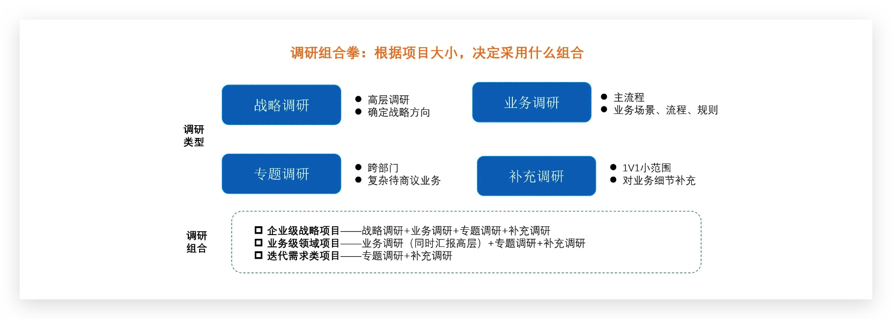
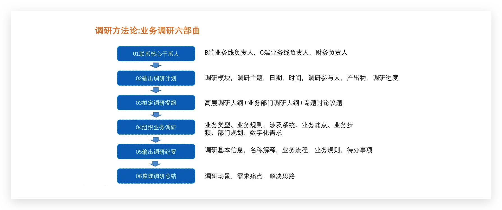
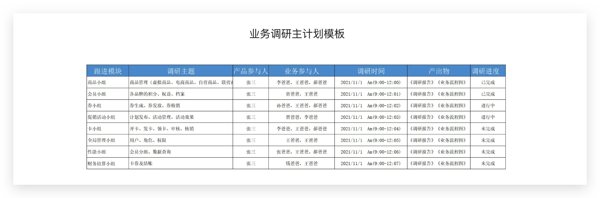

>编辑导语：在产品设计开始前，产品经理常常需要做业务调研，但是在业务调研过程中，会遇到很多问题，导致后续步骤无法顺利推进。作者从实践中总结出了一套如何进行B端业务调研的方法论以及一份避坑指南，供大家参考。

在中台产品经理面试的过程中，我经常会问“如何做业务调研？” 很多产品经理对这个问题的回答特别简单：找相关的业务部门，了解具体流程，然后设计产品。甚至有些产品经理说，“业务不太懂产品，我们调研比较少，都是我们自己找竞品对照”，这些回答是典型不重视业务调研的表现。

所谓业务调研，是对业务的全过程进行还原，并进行需求和痛点的挖掘过程。所以业务调研是B端产品经理了解业务最重要的环节。业务调研不充分会带来以下问题：

- 需求挖掘不深入，设计出的产品业务不想用
- 产品上线，场景缺失严重，业务不闭环
- 多次轮番调研，业务不耐烦，折腾人
- 好不容易上线产品，老板不看好
- 都是点状需求，看不到业务价值

可见业务调研不充分，危害极大，严重时会出现方案汇报不通过而导致项目中止情况。

那么如何组织一场体系化的业务调研，作者在实践中总结一套调研方法论，供大家参考：

## 一、根据项目大小确定调研组合

我们把调研分为四种类型：高层调研，业务调研，专题调研和补充调研。

- 高层调研：老板为什么启动这个项目，项目的战略意义和老板的期待
- 业务调研：按照业务模块或部门，调研具体的业务场景，业务流程，业务规则
- 专题调研：业务调研过程中，遇到复杂问题或跨部门决策问题，则需要启动专题讨论
- 补充调研：产品设计过程中，发现之前业务逻辑了解不够细致，需要启动小范围或一对一的补充调研

根据项目大小的不同，确定调研组合：

（1）企业级战略项目，老板也特别重视，那么首先要做高层战略调研。了解老板为什么启动这个项目，项目的战略意义和老板的期待。

（2）如果是企业在实际经营过程中，启动的专项项目。比如OMS，OA，SCRM项目，则重点调研业务需求方即可，无需做专门高层调研，给高层做汇报即可。

（3）项目调研过程中，遇到复杂问题或跨部门决策问题，特别是涉及到财务，审计，审批等多方决策。则需要启动专题调研。

## 二、调研方法论：调研六部曲

根据项目的大小确定调研的类型和层级后，可以按照：确定调研干系人、输出调研计划、拟定调研提纲、组织专题调研、输出调研纪要和调研汇报6部曲进行完整的业务调研。

### 1. 联系核心干系人，进行粗调研

每个项目都有项目的发起方，一般都要“IT方接口人+业务方负责人”组成，和相关负责人商量如何进行业务调研，共同确定所需要调研的业务部门，同时取得他们的配合。

业务的核心干系人，主要包括：B端业务线负责人，C端业务线负责人，财务负责人等。

首先利用1-2天，联系到项目核心干系人，进行粗调研，了解大概业务需求，该业务主要涉及的部门和主流程，和核心干系人共同制定调研计划。输出：会议纪要+业务L1级主流程+调研主计划

### 2. 输出调研主计划

按照第一轮粗调研过程中输出的L1级业务流程，梳理所涉及的业务部门，按业务场景或部门，梳理调研计划。调研计划主要包括：调研模块，调研主题，日期，时间，调研参与人，产出物，调研进度。

### 3、拟定调研提纲

根据调研计划，拟定调研大纲，把调研主线细化，深入。调研大纲主要根据业务场景先梳理checklist。调研大纲目的：①发给业务，让他们提前准备相关材料。②按照大纲进行逐个调研，避免出现业务场景遗漏和偏差。

高层调研调研大纲：

- 了解为什么老板会启动这个项目；
- 这个项目对集团战略的意义是什么；
- 老板对这个项目的期待是什么；
- 这个项目上线，老板希望达到的效果；
- 若这一期项目结束，后面运营策略是什么；

业务调研大纲：

- 业务所涉及的相关名称及概念的定义；
- 业务相关的主流程是怎么样的；
- 流程相关业务是如何管理的；
- 每个业务场景所涉及规则，场景，子流程；
- 业务状态流转流程；

### 4、深入业务调研

拟定调研提纲以后，开始按调研计划进行调研。调研的主要内容包括：

- 业务类型：部门主要有哪些岗位，各岗位主要工作是什么？
- 业务规则：各岗位的工作流程和业务规则
- 涉及系统：所涉及的业务系统有哪些，每个系统做哪些操作
- 业务痛点：工作过程中有哪些业务痛点（痛点是指业务抱怨比较多的地方，一般是对已有功能的重构机会）
- 业务频率：各业务的操作频率，每小时一次，一天一次，一周一次，一个月一次，还是突发才会处理，突发频率大概怎么样？（操作频率决定后面场景实现的优先级）
- 部门规划：部门未来一段时间，（短期，中期，长期）有没有规划，主要规划是什么？
- 数字化需求：对数字化建设，有哪些建设需求（需求指没有实现的功能，是对新功能发掘机会）

根据以上调研大纲，从业务类型，到流程，规则，都有了很清晰的梳理，基本能够很全面的了解现在业务现状。同时针对现有的业务现状和未来规划，再挖掘需求和痛点，这样保证产品需求来源于业务，避免了产品实现过程中业务说没有业务价值的问题。

同时，通过对业务操作频率的分析，来判断需求场景实现的优先级，对中台建设的分步实施提供指导：哪些场景可以先实现，哪些场景可以后实现，哪些场景可以先不实现，业务手工去操作。

### 5、输出调研纪要（含业务流程）

调研纪要的输出，主要包括：调研基本信息，名称解释，业务流程，业务规则，待办事项to do list等5个部分组成。（需要模板可留言）

### 6、汇报调研总结

整个调研结束，需要输出调研总结报告，同时需要向业务各方及领导进行调研汇报。  
调研汇报目的：进行调研复盘总结，确认业务需求，确定项目边界（哪些本期项目实施，哪些在其他项目解决），确定需求优先级（哪些先解决，哪些后解决）

## 四、调研过程中踩过的坑

### 1. 如何让业务方配合？

业务愿不愿意配合，取决于这件事情对他的价值。正常两种解决模式：行政命令和说服诱导。行政命令就是搞定他老板，让他老板支持这个项目。说服诱导就是先不要提工作，先告诉他这个项目成功给他带来的价值是什么，让他看到希望。

### 2. 如何挖掘到业务痛点？

我们一般把需求分为痛点和新需求，痛点一般指现有业务在运行，但业务诟病很多，需要改正的。新需求是由于业务发展需要而新增的需求。

### 3. 调研的痛点是不是都要解决？怎么分优先级

需求是否都解决，根据项目的边界，确定哪些需要本次项目解决，哪些是其他项目解决，比如业务需求调研中，会产生很多报表需求，审批的需求，那就要单独立报表项目或OA项目来解决。  
参考业务操作频次和闭环逻辑来确定需求的优先级，划分大闭环和小闭环。保障项目交付一定是业务闭环的。这样确定项目迭代周期和优先级，哪些第一迭代完成，哪些第二迭代完成。

### 4. 调研过程中经常出现分歧和沉到细节讨论里面怎么办？

调研过程中，如果遇到细节问题，不要过多对细节问题进行讨论，后面可以组织专题讨论。如果遇到争议的问题，也组织相关方专题讨论，专题讨论过程中，同时约上争议方共同的领导参与。如果讨论不出结果，可以由共同领导拍板，而不至于讨论无结论状态。

### 5. 调研中很多细节，当事人不在怎么办？

调研过程中遇到需要提供补充材料的，需要在会议纪要中列出待办清单，待办清单中明确具体的责任人和关差时间（DDL）。

摘录自 [@布衣_中台与数字化转型（三）：如何进行B端业务调研及避坑指南](https://www.woshipm.com/zhichang/5213200.html)
