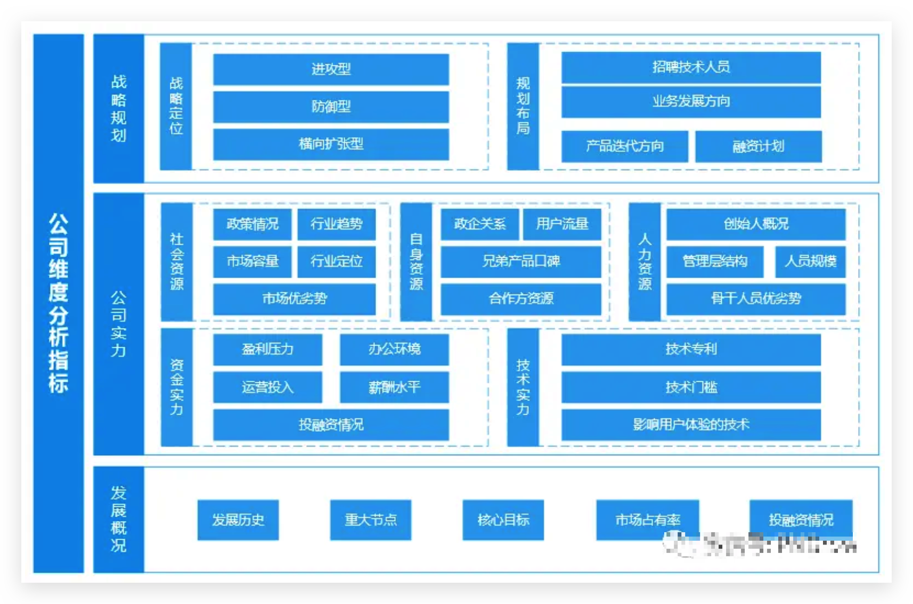

之前文章中有提到过，B端产品经理本质就是满足企业的“组织欲望”；B端产品的种类繁多，行业不尽相同，不同的行业、不同的使用人群，最后表现出来的特征就不同，产品满足的需求以及产品最终形态会千差万别。

我们做一款C端产品或者做某个功能之前，会先进行市场/竞品的调研，通过调研来了解市场容量、行业情况、竞品情况；但是B端产品与C端产品不同，由于B端产品的定制化、专业性，我们很难深入了。

相比于C端产品，B端产品的分析难度确实很大，难点主要有以下3个方面：

1. 信息获取困难：因为B端产品大多数都要钱，不要钱的产品要么试用功能少，要么不符合自己公司的产品定位，所以获取竞品信息的渠道途径较少。另外针对细分领域（例如：无纸化办公、某某智慧城市管理后台）资料很难获取到，就算能获取到也是一些非常官方的简单介绍性的东西，对于自己竞品分析本身无实质性帮助；
2. 标准化产品比较低：B端产品早期都是为某一类行业客户定制化开发的，所以行业客户特征影响比较大， 组织特征、商业模式、地域特征等影响，都是没有办法标准化的；
3. 分析竞品，需要行业内知识，需要充分理解B端产品所在的行业情况，具备行业内的相关知识（例如要打造一个视频PaaS平台，至少要知道流媒体从采集到传输到播放的整个逻辑，压缩编码的一些常见的知识）；

所以，如何做B端产品的竞品分析呢？可以通过以下几个步骤来完成：

**1.确定目的** => **2.选择竟品** => **3.选择分析维度** => **4. 收集信息** => **5. 信息分析整理** => **6. 结论及规划**

## 一、确定目的

首先要确定，自己做一次竞品分析的目的是什么，带着目的去做事情，才能更有方向性。一般的，竞品分析的目的有3个方面：

### 1. 了解市场，寻求产品差异化

通过差异化定位，打造自己的优势，抢占市场份额。这个层面的竞品分析，重点是了解市场，进而确定自己的定位。

例如：早期的美团，通过大量的市场调研，竞品的分析，发现创办了5年的饿了么，虽然已经进驻12个城市，但是全国至少还有18个消费能力更强、更应该进入的城市，处于空白阶段，而这正是美团的机会所在。

### 2. 了解竞品，学习借鉴

学习借鉴对方的优势，借鉴对方的产品设计；构建完善自己的产品壁垒，深入挖掘需求后，构建自己的产品生态。

例如：抖音火爆的时候，微视早期版本与抖音的相似度非常高，在KOL的引入上，呈现的内容上，都是一路模仿，学习借鉴。

### 3. 了解市场与竞品，监控行业动态

对于相对成熟的产品，要定期对市场情况，行业数据，市场的竞品情况进行调研：

一方面，产品经理要时刻了解行业的变化趋势，了解产业链的变化结构；另一方面也要同步了解市场上是否有新进的竞品出现。已有竞品是否有战略性调整，是否推出行业新玩法。

举个以前自己公司的例子：当时我们每周都会输出一份标准的产品运营报告，在报告中，会对部分产品的部分维度进行“以周为颗粒度”的实时监控，大致结构如下：

## 二、选择竞品

### 1. 竞品的选择维度

一个领域内，总会有很多公司推出自家产品,不同领域也会有公司介入，各类竞品蚕食市场的整体份额，那么要如何选择竞品来进行分析呢？

我们可以从以下几个维度来分析：

**1）产品的“祖宗”**

该领域内首个产品；要了解对方的创始人背景、当时的想法、经历等等，有可能顺着对方的思路可以做一些微创新。例如SaaS云视频会议行业，国外的zoom。

**2）直接竞品**

即与自己即将要做的产品方向最相关的竞品，也叫对标产品。直接竞品需要全方位的了解，知己知彼才能百战不殆。

**3）间接竞品**

即与自己产品方向看似不相同，或产品方向不完全一致的产品，例如：外卖市场蚕食了泡面市场。

**4）头部竞品**

即在行业内做的比较领先，市场份额处于领先的产品，例如：腾讯会议在中国的SaaS云会议里处于第一的位置。

**5）关键干系人的推荐**

即可以决定产品方向的人给出的推荐产品。

例如：销售发现客户已经在用一款OA系统但即将到期，销售通过自己的关系，将下一期的订单拿下，并告知产品部门，客户之前用的产品以及相关资料，希望产品部门能够做的更好。

那么这个时候做竞品分析时，就需要仔细研究干系人推荐的产品。

### 2. 如何找寻竞品

根据以上几个维度，我们可以去筛选我们的对标竞品；我们该如何去查找竞品呢？竞品获取的途径都有哪些呢？

**1）关键词联想**

通俗的说就是通过一个关键词搜索出来的结果，找到其他的相关关键词。

例如，搜索“产业互联网”，可以相继找到产业互联网分类：交易平台、增信融资平台、智能制造平台、服务业重构平台；进而进一步去了解每一个平台是什么，有哪些企业，哪些是跟自己的产品方向更接近的。

这个方法一般适用于，自己目的不是很明确的时候，可以先使用“关键词联想”来扩展思路。

**2）行业论坛**

大部分行业都有自己的信息发布平台，可以去平台上搜索，例如：搜索“智慧城市论坛”会出现“千家网”。

**3）媒体报道/行业峰会/第三方机构/行业报告**

我们在查找竞品的同时，也在搜集竞品的信息。

所以说，一些报告中提到的竞品也不能放弃。另外有时候会举办一些线下行业峰会、线下的展会，都可以参加，寻找竞品，搜集信息。

**4）企查查/天眼查/爱企查**

通过这些网站，可以找到对应的一些竞品。

例如：在天眼查中搜索`平安智慧城`并进入该公司的主页下，浏览可以看到很多关联竞品，不过这些不是很精准，需要对每个竞品进一步的浏览。

**5）七麦数据**

如果已经找到某一款竞品，尤其是APP类的产品，可以在七麦数据网站中搜索它，然后查看其“IOS版本→应用信息”页面一直下拉，会看到官方的推荐，从中可以查找。

例如：我通过腾讯会议可以找到的竞品如下：

## 三、选择分析维度

一个竞品的分析，不仅仅是分析其某个功能点是否好用，更要了解其过往背景，所以我们将从以下3个维度来解构竞品分析的维度：

### 1. 公司维度分析指标

**1）发展概况**

了解一个公司的发展情况，能够更加清楚的从宏观判断，当前产品背景情况。一般发展概况包括：发展历史、重大节点事件、核心目标、市场占有率、投融资情况等等。

**2）社会资源**

除了了解本公司的发展情况，也需要同步了解其所在社会的资源情况，例如：政策情况、行业背景及趋势、市场容量、优劣势、公司在行业中的定位等等。

**3）人力资源**

公司情况了解后，需要了解公司内部，人员情况，对于大公司，一般了解竞品所处团队的人员结构情况即可。

对于小公司，需要了解创始人、管理层结构、优势及规模等；如果有机会，最好能进一步了解清楚公司的人才构成，各个环节的骨干力量，木桶中的长短板。

**4）内部资源**

了解当前竞品团队所具备的资源优势，可以进一步探测清楚竞品的研发实力，例如：国企关系、相关兄弟产品的口碑、用户流量、合作方资源等。

**5）资金实力**

了解竞品团队的资金实力，也是进一步了解对方的研发实力的手段之一，同时根据其资金实力，可以侧面猜测对方的短期、长期策略，例如：盈利压力、办公环境、运营推广费用、薪酬水平。

**6）技术实力**

了解对方的技术实力，可以更清楚的知道，对方的核心技术点在哪里，有哪些技术优势。一般的技术实力，从三个方面了解：

1. 影响用户体验的技术，例如：H5混合式开发， 对方的页面响应速度非常快，但占用资源少；
2. 技术专利，了解对方专利技术有哪些，都是属于哪一方面。比如技术性专利，很有含金量，但是外观性专利则含金量不足；
3. 技术门槛，了解技术门槛可以更加明确，如果自己要进入对方领域，难度有多少。例如：人脸识别技术，前期需要积累大量的人脸数据，数据获取就是门槛。

**7）战略定位**

了解对方的产品，属于进攻型产品、还是防御型、横向扩张产品；不同的战略定位，公司所投入的资源势必不同，最后产品成功的几率也会受到影响。

部分企业，在第一业务发展比较良好的时候，会开始横向拓展相关联的更多维度的业务形态，以求寻找自己的第二曲线。

**8）布局规划**

了解对方接下来要做的产品方向，计划等信息。同时也要了解清楚接下来对方要怎么做的信息，例如：开发什么功能、招聘什么人员、融资还是并购等等。

### 2. 产品维度分析指标

公司的背景了解清楚后，我们重点要了解竞品这款产品的情况，进而找出核心竞争力和优化方向；竞品产品的分析，重点从以下几个维度展开：

**1）产品定位**

与公司的定位不同，产品定位，重点关注当前竞品的核心定位，包括产品属性、产品定位（设计、定价），供应链级，核心竞争力等等。

**2）用户画像**

了解产品的定位后，下一步要了解的是当前产品定位的目标用户的特征，因为我们是toB产品，所以重点了解目标用户的组织特征、组织中的用户特征。

一般的，我们需要进一步了解一个组织的组织结构、角色权限、功能使用频率、使用时段、规章流程等等。

**3）产品功能**

对于产品功能的了解，包括产品的产品业务流程、用户使用流程、核心功能、特色功能、界面展示情况、迭代优化情况等信息。

**4）产品性能**

除了功能部分着重关注以外，竞品的性能指标也是需要重点关注的。

例如：页面打开延迟、视频卡顿频率、视频清晰度、CPU占用率、内存占用率等等，当然根据不同的产品，性能的指标也是不同的，所以不局限于上述性能指标。

**5）盈利模式**

一般情况下，B端产品的盈利模式很比较明确，软件授权使用，定制开发、业务分成、SaaS租赁等方式。

### 3. 运营维度

B端产品的运营与C端不同，B端的交付方式比较多，根据交付方式不同，最后的运营方式不尽相同，但大致可分为两类：

**1）类C端产品运营方式**

此类产品主要以SaaS类交付为主，多数情况下：

前期通过各类网络进行推广，获取销售线索；中后期直接发布产品，标准化上线交付，由专门的客户成功及客服进行对接，完成产品的使用培训；使用过程中，会有专门的人员进行跟进，反馈问题，督促续约等。

所以在做竞品调研时，能尽量深入了解这些过程，会对产品的运营有很好的帮助。

**2）类软件开发产品运营方式**

此类产品，一般定制化开发程度较多；前期获客方式与C端产品类似，都会进行各类推广。

在获取到销售线索后，开始与客户接触，前期充分调研需求、了解客户需求及日常流程；然后有专业的方案经理进行方案的输出和接触，方案通过后，即开始确定需求，然后进入产品开发。

开发完成后，会有专业的售后工程师、项目实施工程师、培训讲师等对产品进行交付、运维、培训，例如：系统交付后，提供全部代码和技术文档；3个月内为甲方单位提供2次全面系统使用培训；提供1年的免费运维服务。

在数据维度上，产品的两类产品的关注维度也不尽相同，前者与C端类似，更加关注下载量、注册量、激活、新增、留存、转化、召回等指标；而后者更加关注的是键词搜索排名、销售额、市占率、百度指数、成本结构等指标。

## 四、收集信息

了解了竞品分析的各个维度，这么多指标，我们该怎样才能找到相关的指标呢？其实网上也有很多竞品分析的方法，这里我就根据自己的工作经验，做个简单的总结：

### 1. 通过官方渠道了解竞品信息

- 官网：产品介绍、slogan、公司融资情况、高管情况、发展历史等；
- 内部出版物：大型企业的一些内部宣传或培训功能资料、操作说明；
- 产品试用：部分SaaS产品提供试用账号，可以通过试用测试了解产品功能；
- 联系销售：通过口头沟通、索取纸质材料等方式，获取产品详细功能，产品优势、代表客户、产品定价等；
- 官方自媒体：最新的动态，发布的一些新产品信息规划，功能亮点；
- 公司财报：对于上市公司可以获得其销售数据、盈利亏损情况，对于未上市公司，需要通过更多渠道途径来侧面评估，如官方披露的销售额等等；
- 官方案例：获取代表客户、服务模式、合作模式、获客模式等信息；
- 内部账号：不同于试用账号，如果有更好的渠道，利用朋友、同事等获取竞品的内部账号（竞品的用户的员工），然后对其产品进行体验测试，会更加了解其产品；
- 客户热线：伪装成普通用户或者产品需求方，获取对方信息。

### 2. 通过竞品的关联人员了解竞品

- 竞品的客户：假装成供给侧，去找竞品的使用方，然后与其沟通，并侧面打听甚至直接了解对方对于某些竞品的看法；
- 核心人员简历（经历）：过往经验、擅长的领域，推测其新的产品方向；
- 核心人员入职时间：根据一个大方向的迭代周期，计划其从关闭招聘某个核心岗位开始的时间，大概可以预估出对方何时能上线某些功能；
- 面试竞品公司人员：有时候，往往竞品的相关人员会考虑跳槽面试，这个时候，可以主动面试对方，了解对方的一些核心的数据；
- 招聘jD：根据对方的人才需求趋势，判断业务拓展或开拓方向；
- 猎头：与竞品公司合作过的猎头、有经验的猎头对行业宏观信息比较了解，可以了解对方的业务方向；
- 业务合作洽谈：有些时候，对于部分间接竞品，可以考虑进行资源的整合，此时由竞争关系变为合作关系，可以高效全方位的了解对方的产品。

### 3. 通过第三方信息了解竞品

- 招投标信息：通过招标采购的中标信息查看价格，提供的服务，进一步了解竞品的情况；
- 近距离观察：如果通过某些渠道（展会、峰会、博览会）等可以近距离接触到竞品，可以详细的观察了解对方的产品；
- 行业会议：虽然本质上是为自己做广告、但是多少有些干货；一方面可以了解竞品的产品，另一方面，可以遇到很优质的同行以及客户，更加全面的了解行业信息；
- 第三方网站：很多第三方网站，会刊登竞品的相关信息，有些甚至通过调研后会深度分析竞品，我们可以借鉴：
	-  1）行业报告（宏观数据）：主要用于了解市场规模、行业现状、主要模式等宏观信息；
	- 2）指数排名（微观）：了解具体某些个产品的指数排名情况；
	- 3）公司工商信息：了解产品背后公司的工商、税务、投资背景、经营风险等情况；
	- 4）问答社区：在一些问答社区汇总，可以与竞品的客服人员，或者业内人士进行专题讨论、专业知识获取；
	- 5）文档下载：财报、产品文档、使用说明书、行业报告等；
	- 6）数据采集（To B)：更加直观、更权威的企业数据、但是一般要企业采购；
	- 7）垂直细分行业：所属行业垂直领域的信息平台，有更多专业性的信息可以了解；
	- 8）专利/软著：部分B端产品，有时候会很在乎自己在专业所属领域的一些知识产权情况，所以了解其是否正在申请某些专利软/著很有必要，可以进一步了解其对方的战略布局。

## 五、信息的分析整理

了解了以上分析维度，那么我们要对某些竞品进行分析，该如何展开呢？

一般的，我们会根据自身产品的发展情况，选择性的进行分析。一般在产品发展的不同阶段，对应分析的侧重点会不尽相同，以下是大概列举的分析侧重点，仅供参考：

| 产品阶段 | 分析的目的                        | 分析维度参考                                       |
| ---- | ---------------------------- | -------------------------------------------- |
| 概念   | 1、了解行业信息 2、探究商业模式         | 发展概况、战略定位、规划布局、资金实力、自身资源、社会资源、产品定位、用户画像、盈利模式 |
| 产品规划 | 1、投资决策 2、需求分析 3、确定执行方案 | 人力资源、技术实力、资金实力、用户画像、产品功能、产品性能、盈利模式           |
| 设计开发 | 1、功能交互参考 2、设计风格参考         | 用户画像、产品功能、产品性能                               |
| 运营   | 1、制定竞争策略 2、制定运营计划         | 运营方式、数据维度、规划布局                               |

挑选不同的产品侧重点，整理成精品分析的大纲，每一个侧重点不能凭空猜测，必须要找到切实可行的结果；信息能获取到就获取到，获取不到也不能胡编乱造。

如果加入了自己的猜测，例如写竞品的布局规划，也一定要说明清楚这是猜测，猜测的依据是什么等等。

以上就是B端产品竞品分析的内容。以上所列的指标有很多，实际情况下，不一定能够获取到对方的指标，但是要尽量多的获取到，并且用尽各种办法，尽量获得越多指标越好。

## 六、结论及规划

竞品分析的最后，是要得到自己的结论，而不是简单的分析一下竞品。简单的分析竞品，对竞品“品头论足”，最后无法也就是发发牢骚，没有任何意义，所以我们在一开始就提到了，要带着目的去分析竞品。

最终的分析结论，也可以根据自己的分析目的，针对性的总结，一般总结的维度可以从以下几点出发：

### 1. 竞品分析的背景，目标是什么？

一般情况下， 调研竞品，要非常明确，自己调研竞品的背景是什么？目标是什么？最终的目的是什么？这些问题必须要想清楚，没有目的的调研，都是“耍流氓”。

### 2. 竞品的选取原则

通常，我们一般会找到很多竞品，我们该怎么做取舍呢？一般的，根据竞品分析目的来进行选择：

**1）了解市场情况**

在产品的规划初期，或者即将要切入某个领域，我们需要了整个市场情况，了解市场里有哪些玩家，行业产业链是如何的。

所以一般情况下，我们会全品类了解竞品，然后把产业链上、中、下游的头部代表竞品都了解一遍，了解不需要太细，但是要明确每个头部的产品是什么、定位是什么、优势点在哪里、相互之间的对比点是什么，然后选择较为典型的竞品，进行分析。

一般选择的时候，选择的产品要与自己的战略方向大致相似，或者相同，在业内属于头部，或者某个产品在其竞品领域里面，业务覆盖广，玩法新颖，一直处于创新者或引领者，就可以选择其做为竞品来分析。

**2）学习借鉴**

一般的，学习借鉴时，自己已有的产品已经上线，具有一定的市场情况。

此时，根据要学习的目的，选择代表性的竞品。例如，要做界面的改版，则选择业内界面、交互做的好的产品。当然，一般的也会选择头部的产品，因为头部产品的各个方面都比较领先。

在学习借鉴的时候，不一定要了解自己行业的产品，如果是做页面交互分析，或者视觉分割分析、或者商业模式分析，可以看看跨领域的产品，从中吸收灵感。

**3）行业监控**

行业监控阶段：一方面要监控市场新的动向，新的新闻等；另一方面要监控已有的产品变化，此时一般会选择产业链上、中、下游比较头部的产品进行监控。尤其是与自己产品属于直接或间接的竞品，更要密切监控。

总之，要根据分析的目的，有选择性的去挑选竞品。

### 3. 信息的分析

根据上文提到的分析维度，分析方式，有选择的进行分析。

一般的，先分析宏观因素，包括行业发展等因素，再分析微观因素，包括具体的某些竞品，竞品的各个维度以及表现指标，从公司维度、产品维度、运营维度上去拆解各个指标，深入的分析。

### 4. 总结及下一步规划

整理以上的分析，总结各个产品的优缺点；找到自己要发力的层面，然后规划和布局，制定自己的产品发展策略。

以上，就是整个B端产品如何进行竞品分析的方法步骤梳理。

其实对于竞品分析，大多数人会套用网上的模板。但是万事都有两面性，对于刚入门的产品经理，可以去套用模板进行分析，看看网上的模板案例都包括了哪些维度，然后自己去套用，梳理成自己的竞品分析报告。

如果是在行业内沉淀了多年的产品，其实在竞品分析时，不一定要用到模板，更多情况是根据自己的实际需求去分析竞品；但是在竞品分析的过程中，要时刻牢记以下4点：

**1）一定要带着目的去分析竞品**

竞品分析的目的，可能是工作上需要，也可能是自己想要提升这方面的能力，但是一定要明确出自己的目的，然后开始分析，否则就像“无头苍蝇”一样，分析成流水账，最终没有任何意义。

**2）根据受众的不同，选择竞品分析的颗粒度就不一定相同**

- 对于产品内部团队：一般竞品分析需要非常详细，从宏观到微观，从功能到性能，尽量把每一个维度指标都进行拆解和分析，详细的去了解竞品是必不可少的；
- 对于运营团队：要尽量突出竞品新颖亮点的功能，同时要结合运营团队的运营方法，分析竞品在运营、市场策略层面的分析，最终给到运营团队建议；
- 对于管理团队：更多是是侧重宏观的战略、策略层面，分析竞品做的事情，推出的功能逻辑，而分析的最后，一定要给出自己的见解，给出对于自己公司下一步产品的规划和建议以及理由；
- 对于研发团队：更多的是从功能、技术性能维度来进行分析和梳理，通过“对比法”等方法来突出竞品在某些技术层面的优势，从而给出技术团队相应的建议。

**3）根据实际投入资源来进行竞品分析**

竞品分析报告，是一个非常耗费精力、时间的过程，同时产出的结果也很难量化。

对于大公司，有专门的用研团队、竞调团队来做；而对于中小型公司，不同职位由于关注的角度也不同，所以做出的竞品分析维度又不尽相同。

我们需要根据公司可投入的资源（包括时间、人力等）以及需要分析的目的，综合性的取舍一些指标，一些没必要的维度和步骤，可以省略。

例如要调研各个竞品的登录方式，可以不用关注竞品的宏观性指标，直接调研其登录的方式即可。

**4）竞品分析报告的展现形式是多样化的**

不同公司，不同团队都有自己的协作习惯以及信息的传递方式。

竞品分析报告，可以是电子表格，可以是海报、PPT、Word文档等等，只要能够高效的把自己的结论传递给受众人群即可，每种报告的写作方式不同，特点也是不仅相同的。

所以我们要关注的是，信息是否能够高效传递，而不是关注具体选择什么形式来转写报告。

转载来源：[两只猫爸](https://www.woshipm.com/evaluating/4250256.html)
