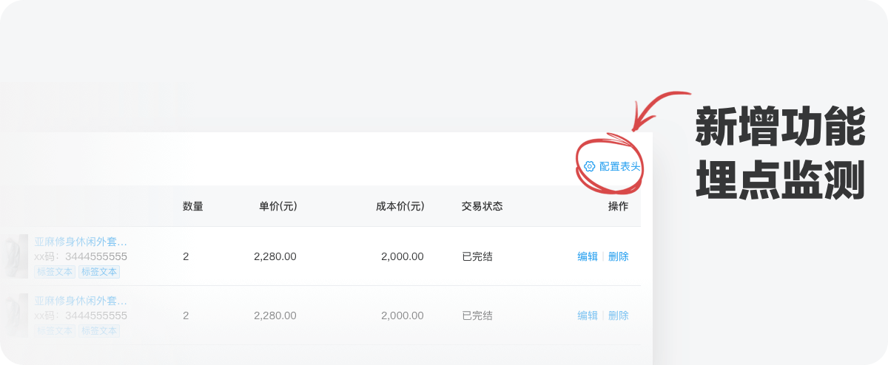
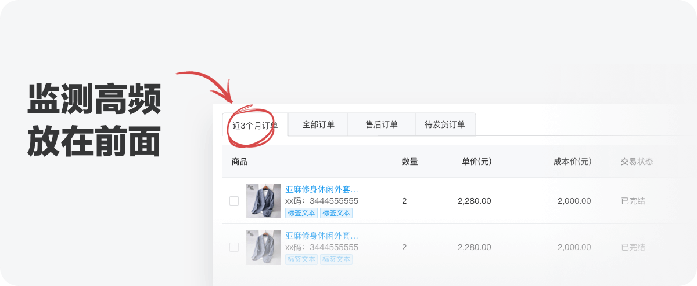
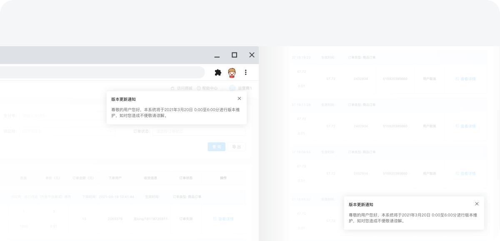
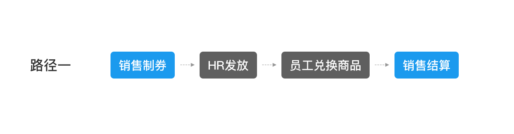
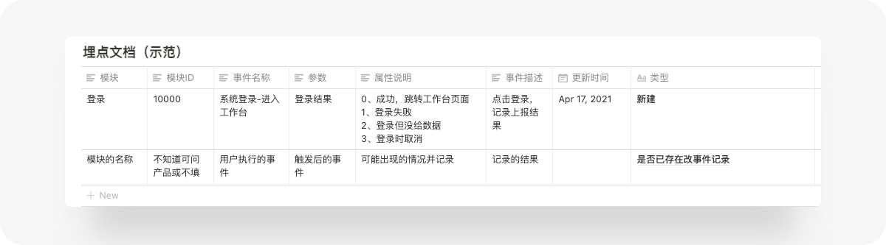
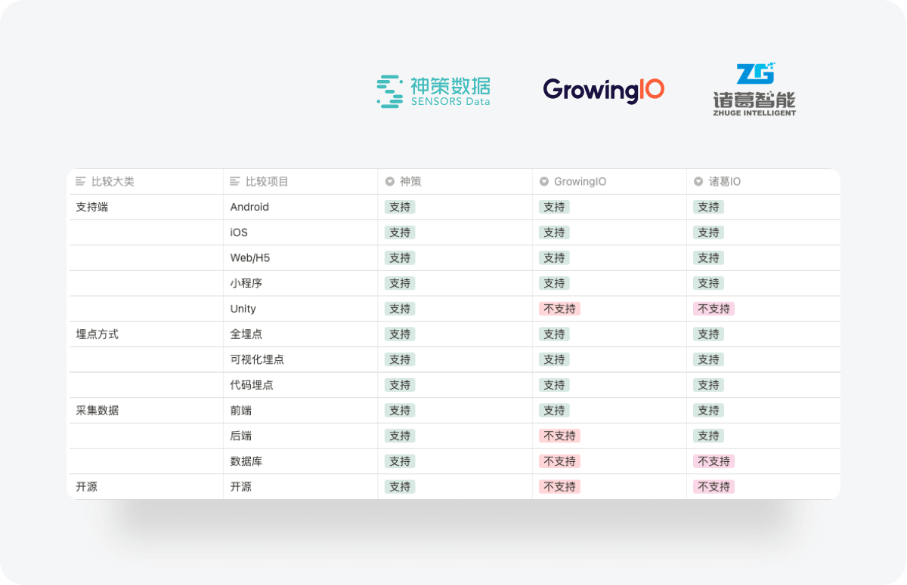

哈喽~ 不知各位奋斗在一线的B端小伙伴是否会常常会有以下的困惑？

- **01.现有的设计方案是最适合用户的吗？如何通过科学的手段去验证呢？**

- **02.设计了多个版本的方案，究竟哪个版本是更好的？为什么是这个版比较好？**

设计师在输出设计稿时，通常会使用各式各样方法论来辅助设计，如：用户调研，竞品分析，可用性测试等。但是这些方法论并不能很客观验证我们的设计；想要客观验证我们的设计只有通过数据去发掘有方案里面的问题，验证最终方案是否有效；而数据的埋点是我们打开数据思维的重要一环。   

## 什么是数据埋点？

> “应用埋点数据”也叫“埋点数据”或“前端页面数据”，我们可以简单理解为“通过技术手段获得用户在应用内（网站、客户端、小程序等）的操作行为数据”。其背后原理是：用户和界面发生交互，系统需要向服务器发送请求和返回请求，把这些请求预埋一段计数代码，就能得到页面的曝光数据和用户的操作数据。—— 摘自《腾讯文档 - 数据化设计》

  
拿个通俗的例子来讲，数据埋点就像是我们城市街道里面的摄像头，每一个摄像头、都是城市这个大系统的一个埋点，它监控记录着这个区域里面发生的一切事情，满足交通、市政、企业管理，等等的需求。通过这个比喻是不是就能很快明白什么是数据埋点了呢？

我们对埋点的定义有了一个基础的认知，那么请各位小伙伴们想一想，我们在日常工作中数据质量惨淡的原因是什么？这边给大家5秒钟思考一下~

5

4

3

2

1

相信大家或多或少都会有一些小思路！那么此处分享一些我们公司数据混乱的原因，起初，我在刚来公司时，整个接受的业务数据质量是存在着非常大的提升空间的，查看了现有数据后发现主要问题在于数据收集这一块没有做好，而今天要提到的数据埋点又是数据收集这块的主要方式，我总结了我们公司数据混乱的原因有以下几点：

1. 前期产品上线压根没考虑到埋点；？？？
2. 埋点后模块数据无法正常上报或者上报错误不进行处理；
3. 埋点方式错误，没有找准关键数据指标；PC端采用了M端的埋点方式，B端产品采用了C端的埋点方式；

不知道有木有小伙伴的情况和我们的一致呢？如果有那得打起十二分精神看下去啦，下面会讲一些怎么去优化这种情况的方法；

## 你的数据来源真的准确吗？

在总结埋点的方法之前，我与很多在B端行业深耕多年的设计小伙伴们交流后，发现一个非常魔幻的现象：的确随着互联网环境改变，无论是在处理产品迭代需求还是运营的活动，都会依靠数据作为一个决策参考，但是通常我们的对数据来源却不会产生质疑，设计师的数据来源通常都是从产品那边拿来的；我们却没思考过产品是从哪里拿来的数据。深挖以后才发现产品对手上的数据真实性其实也没有验证过，因此产品端数据都是模糊的更别提经手到设计这边了。

那么如果我们能通过自身推动埋点需求，获取想要的数据，便从根源上解决了数据真实性的问题了~

## B端设计师需要懂得的埋点知识有哪些？

前面提到了摄像头是监控一个城市是否运作良好的重要工具，同样的数据埋点也是监控我们产品体验良好的重要手段，当一个城市发生交通事故的时候，我们可以依靠摄像头来还原事件的过程，从而得出结论和处理方法，当用户反馈一个问题时我们也可以通过埋点的数据去给我们的产品开处方，避免头疼医头，脚疼医脚的尴尬境地；

### 埋点的两种模式  

1. **私有化部署**
 在一些对数据安全性要求比较高的工地，他们会自主研发或私有化部署适合自身的独立数据系统；

2. **接入第三方服务**
目前大部分公司更多是专注业务本身，埋点直接使用第三方的技术服务；接入第三方技术服务优势在于研发成本低，几乎能满足企业对数据埋点的要求；同样缺点也是蛮明显的，无法定制个性化埋点方案，存在数据风险等；
目前市面上有很多的数据支持公司，例如：神策、GrowingIO、友盟等。

## B端那些地方需要进行埋点？

B端产品，尤其是业务系统，埋点的作用往往观察并研究用户对各项产品功能的接受程度、使用情况，以及用户的操作习惯等，从而进一步评估功能设计是否合理，是否帮用户提高了效率等，为持续优化提供依据。因此就很清晰我们的埋点思路了：

1. **上线新的功能时**
在产品设计前，产品和设计师都会进行一定的调研，依据调研结果判定功能是否符合用户的真实需求，但是前期的调研结果其实是主观的，无论是采用问卷、访谈等形式，用户的反馈并不能其真实的想法，通过埋点新功能相关点位，我们发现用户使用量符合预期，那说明这是一个正确的决策。如果发现没有人用，那可能这个功能宣传太弱，用户没发现，也可能这个决策根本就是错误的。

此处埋点的目的主要在于功能的优化，常用于对新上线功能的检测；举个例子：比如我们产品新上线了一个功能，该功能属于方便用户进行表格筛选。那么我们就需要对这个筛选功能的使用频率进行检测，用以判定我们的业务结果；具体需要测量其那种类型数据指标，这里可以提前说一下是点击量这个指标，具体的类型后面会提到；

2. 核心业务功能  
  
与业务关联性强的都可以算为重点功能，比如我们是做电商零售平台的，那么订单管理，商铺管理这些模块毫无疑问是重点功能，与这些模块相关的用户操作路径上的交互控件都应该受到监控；举个例子：我们公司是做电商零售平台的，最近用户反馈在订单管理里面能不能将近三个月订单放在第一个table上方便他不用去切换，当然不是有单个用户反馈就去改产品的结构的，这时候我们就需要提取这几个table的点击情况来判断这几个table的权重了；如果大部分用户需要来回切换近三个月订单，我们便可以考虑将其放在进入页面的首位；  
  

  

## 判断设计方案  
  
在C端我们可以通过A/BTest的方式来观察数据，看哪个位置或者形式更能引起用户的注意，达到想要的效果。B端产品也会采用类似这个的方式，此处也举个例子：比如最近想要改版一下关于消息通知是从顶部右侧弹出还是从底部右侧弹出更不干扰用户，当然我们可以看竞品怎么做，但是总是借鉴竞品也不是解决根本问题的方法，此时我们可以将时间维度作为测试基本盘，通过不同的方案获取不同的数据来进行决策；  
  

## 用户会触发哪几类行为？

在检测用户数据之前，需要了解用户在PC端上会触发哪几种行为？按照获取数据的类型和用户触发的行为不同，通常可以将用户行为分为点击事件、曝光事件、页面事件三种类型；

- **点击事件**：用户在系统内部的每一次点击行为，都可以记为一次点击事件。比如按钮的点击，输入框的点击，订单的点击，每一条消息的点击等，都可以成为一个点击事件。

- **曝光事件**：曝光事件，简单来说是为了统计系统内的特定区域是否被用户有效浏览。比如工作台，订单中心的表格，系统内的广告位等等。通常来说我们在衡量页面某个区域用户的点击率的时候，首先需要搞清楚的就是这个区域到底被多少用户看到了，点击人数除以看到了该广告位的人数，才能计算点击率。如何统计曝光事件才算合理比较复杂，这个点如果大家感兴趣可以考虑再出文章细讲；

- **页面事件**：页面事件通常是指页面的各种维度信息的统计。常见的比如页面浏览PV，页面浏览UV。
页面事件通常统计的信息包括以下几个部分：
- 浏览器信息：浏览器版本，浏览器语言，浏览器编码，屏幕分辨率等等；    
- 访问信息：用户账号，当前页面url，上次访问时间，访问时长，页面停留时间等等；
- 来源信息：用户到这个页面的来源，上一页面url等等；
- 物品信息：不同的业务，这部分信息会区别很大；

通过了解事件的分类我们再做指标时就不会无从下手了，举个小例子：我们的业务最近上新了一个新功能“消息通知”那么我需要知道这个功能上线后倒地有多少人去使用，那么我就需要获取想消息通知icon的点击率（点击事件），同时我还需要知道这个消息通知列表页面用户一般会看几条信息，因为业务可能会推送多条的更新信息，所以我需要页面停留时长和浏览高度（曝光事件），后续我还得知道用户是那个信息来源来到消息通知页面的，是自主点击“消息通知”icon进来的？还是点击通知提示进来的（页面事件）；通过上面这个例子是不是就很容易理解事件的类型呢？

## 在B端需要获取的关键指标有哪些？

与C端所需要采集的数据不同的是，B端的应用场景主要是web端居多，B端主要采集的数据也更侧重于业务数据、PV/UV 、点击量、浏览器的类型 、 页面停留时长、操作路径等；B端产品，尤其是业务系统，往往借助埋点观察并研究用户对各项产品功能的接受程度、使用情况，以及用户的操作习惯，从而进一步评估功能设计是否合理，是否帮用户降低了使用门槛，提升了工作的效率。从这一点来说B端与C端还是有些区别的；  

### 业务数据

业务数据包含用户的基础信息，比如拿一个电商零售平台来说店铺有几个客服，有几个角色；也包含用户的交易数据，比如说订单数量，订单金额。虽然这些埋点数据可以要求后台直接导出，但是如果这样每次导出都需要开发单独去处理，无法获得实时的数据也很不利于团队氛围营造，所以建议埋点的时候也将此部分的数据统计进去。

### PV/UV

PV：页面访问量，每打开一次页面PV计数+1，刷新页面也是算是加1个访问量的哦~；

UV：独立访客访问数，一台电脑终端为一个访客，通常是算IP的。

这是设计师必须要懂得的两个数据之一哦~

### 点击量

常用于页面中按钮、选择的点击量统计。比如上面的例子：近三个月订单、全部订单、待发货订单的table，是否是高频操作，将那个放在前面，这样排列的顺序是否合适？该数据利于细节优化。  

### 浏览器类型

B端业务大部分场景都是在PC端上完成，我们可以通过埋点了解用户的浏览器类型、屏幕分辨率，做好适配。就像是表格表单等等相关业务控件数据字段特别多，可能在1920px下，正好能看全，但是在720px下，会有一部分数据看不到，这时候要等比压缩，还是做拖拉？

### 页面有效停留时长  

B端用户在页面的停留时长还是能说明一定的问题。比如说我们的业务会有一个店铺装修的业务，这个业务通常交互都会比较复杂，通过检测页面的有效停留时长可以反映目前这个业务用户在使用上是否存在难点，针对性去优化该部分的用户的体验；

### 操作路径

操作路径就是跟着业务流程，来监控用户的操作行为。比如说我们业务上其中一部分流程是这样的：

  
我们可以总结出最常用的流程，来优化使用的路径。但操作路径的埋点，工作量非常大，所以需要在埋点的设计上思考好关键的数据指标；

# 实操：一个埋点需求从开始到落地

上面已知我们要对批量发货、批量标记、批量免运费进行监测，由于我们不能自己去进行埋点，或者你也可以将这个需求告知给产品经理让他帮你出这一份文档，但是我觉得如果设计能写出来给到开发而且能直接跟开发沟通是一件很酷的事情，不妨学习写一下文档；

## 01.整理埋点需求并输出文档

  
  
此处可以看到，一份规范的埋点文档会包括：事件名称、事件属性、数据类型、属性说明、埋点形式、触发时机等，只有将埋点文档梳理规范了，前端小哥才不会和你打架哦~  文档已经上传上来啦，有需要的小伙伴可以按需下载直接使用哦~

## 02.埋点代码的植入

不同于摄像头，数据的采集工具通常为埋点代码，不用的产品形态采取不同的埋点代码植入，通常有三种：js文件，SDK，http请求，具体对应的是M端，网页端和服务器；这块通常是研发来做，产品经理和设计在旁边加油打气就行了。

在研发完成埋点注册后，研发就开始Coding了，通常研发都会采用第三方公司的SDK（可以理解成代码包）这样可以节省大量的工作量，当然如果公司自研SDK期可扩展性会高很多，可以实现全埋点可视化埋点的采集方式，当然这样成本也会高；

现有市面上主流SDK数据分析公司的埋点方式比较：

  
  
## 03.埋点测试与校验

这一部分的内容通常是由测试同学来完成的，测试同学通过测试这些埋点数据，通过后才可以部署上线，此处粗略讲讲他们需要 测些啥：

- 测试埋点数据是否正常报出
- 在数据库里面能不能检测到埋点数据
- 事件和对应属性是否能对的上

当他们将这些点验收完成，研发人员部署上线，就可以等着收数据了~

## 04线上数据追踪

埋点上线后，如果采用的是第三方的SDK公司都会提供对应的数据可视化产品用于数据展示，当然如果自研SDK并没有做数据可视化产品也可以直接叫后台同学提取SQL提数，当然这对设计师和产品经理就很不友好了。  

## 如何利用好数据

### 同一版本只验证一个设计点

有时候我们需要验证某个数据时，需要考虑到是否会有其他的改动点影响到当前的数据，比如上面我们在研究批量发货、批量标记、批量免运费三个table的使用情况，而恰巧这个时候开发小哥说要不要做一个用户可以自定义拖拽table的功能，这样做起来很方便。但是如果这两个优化点同时上线，我们就无法知道这3个Table点击率结果是哪个优化点所带来的效果了，因此我们可以将自由拖拽table放在下一个版本中，避免数据是由多种原因所造成的。

### 保持数据的稳定

C端场景中，用户基数大，可以很轻易确定设计改动结果，比如通过一个改动数据提升1%2%乘以用户基数都是一个客观的数字，但是在B端场景中，更多的反倒是体现在流程的优化上，用户在使用整体流程是否有增加效率，因此我们需要明白验证的数据指标是否正确，其指标是否真实代表此次改动的结果；只有更为精准的数值指标，才能验证设计改动的价值。

## 总结

B端的业务场景中，我们经常会忽视数据埋点，功能都是踩点才赶完的，哪里还有时间和精力做这个，活又多又细，老板、客户还看不到。  

但是当主要功能已经逐步完善，将数据埋点提上日程是很有必要的一件事，B端与C端不同，不再是依靠功能的叠加，而是依靠单个强功能去打开市场。在用户访谈效率低下的情景下，数据埋点是一个很好的工具，可以反映出很多问题来，指导我们精细化设计产品，指导我们前进的方向。

以前我们只需要做好设计，数据埋点常常是产品和数据分析师的事。但是随着互联网的发展，整个行业对体验设计师的要求也会越来越严苛（真是怀念以前只要画图的日子~）未来不再是只需要执行者，还需要对业务的深入了解，以项目合伙人的心态去做产品，尽可能发挥设计的最大价值，特别是在B端设计方向，随着组件库的完善，界面搭建门槛也越来越低。整个行业的水平也会随着时间发展而往上走，深入业务，理解业务，赋能业务才是最终归宿。

参考文献：（待深入研究）
- [[《如何利用数据驱动设计》—-Natalia Babaeva]]
- [[《埋点还是埋雷？ 十年数据分析经验，教你如何结构化埋点！》]]
- [[《数据埋点对B端产品的意义》]]
- [[《腾讯文档 | 数据化设计》-isux]]

  
转载来源：[Weiye炜烨同学_一文读懂 | B端数据埋点_站酷](https://www.zcool.com.cn/article/ZMTI0MzQ3Ng==.html  )

