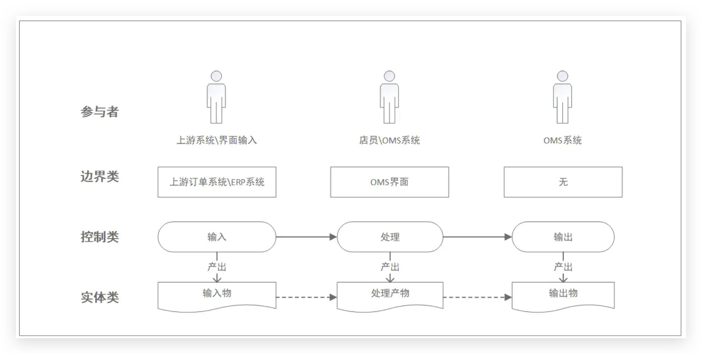
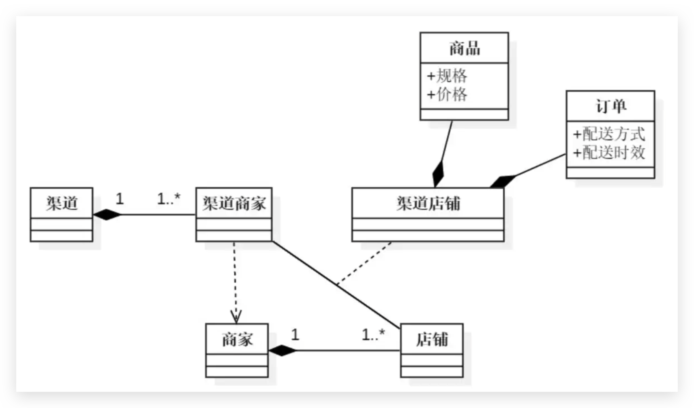
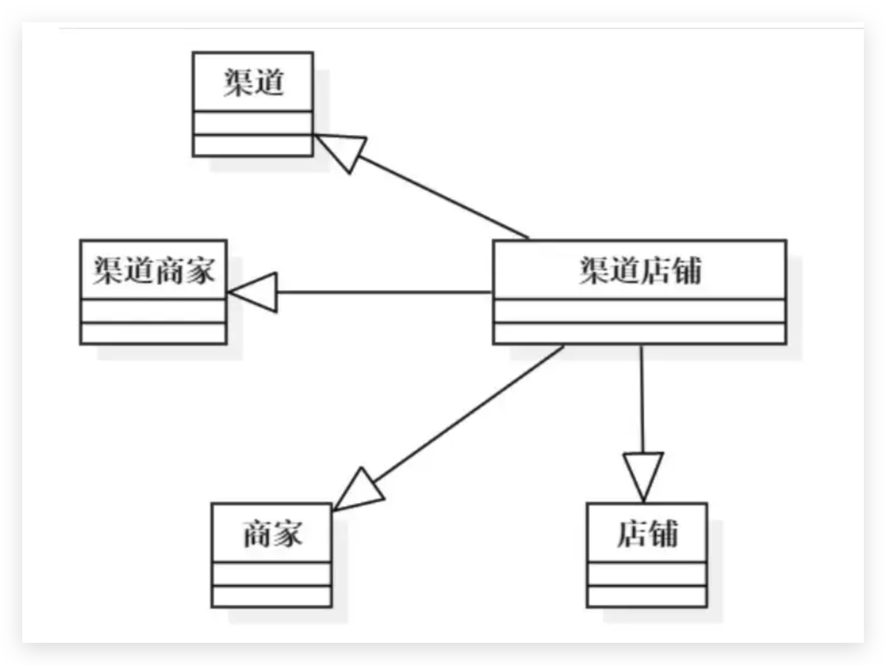
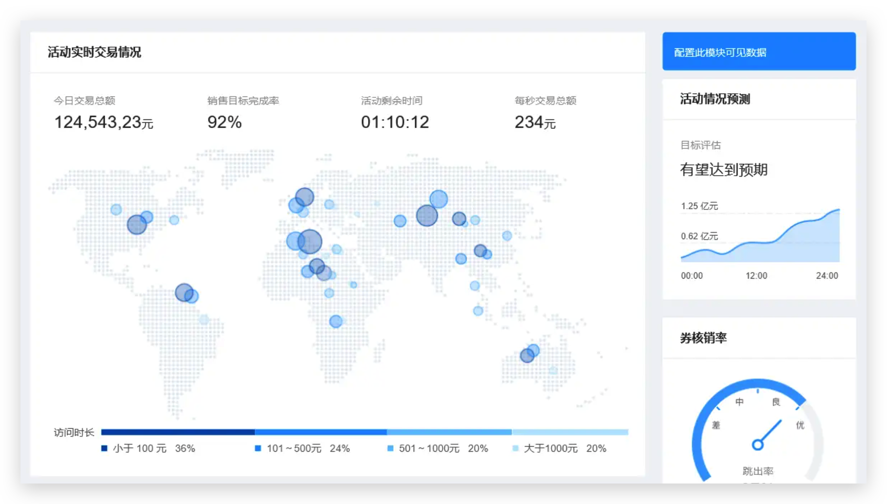
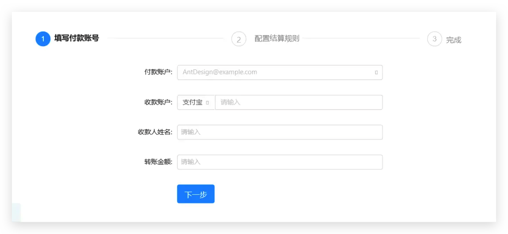
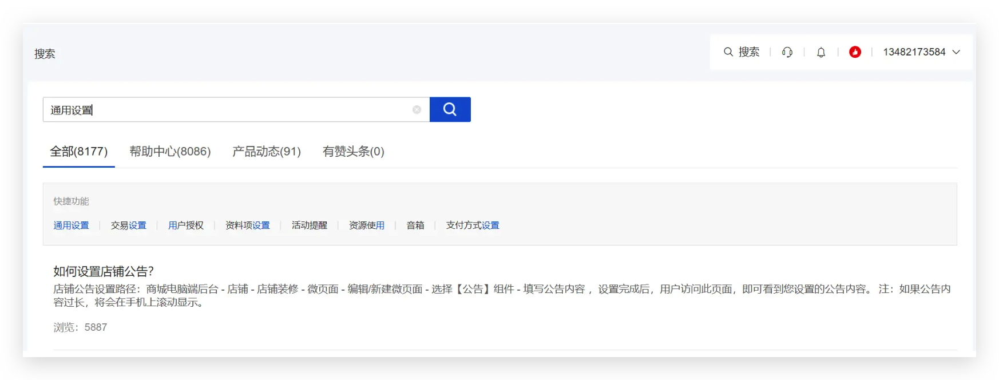
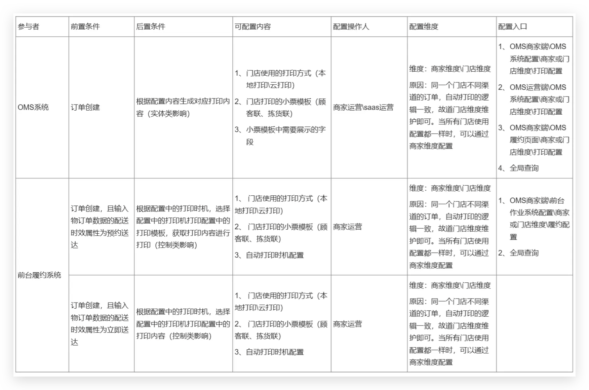

>导读：在大型B端产品中，不可避免的出现各种配置，配置如同一个个控制阀，决定着业务的走向，并实现saas产品的千人千面，以满足不同客户的诉求，适应不同行业的业务场景。但在随着产品的发展，配置项也越来越多，逐渐变的不可设计与维护。给什么做的配置？配置是如何生效的？好的配置具有什么特点？如何确定配置的维度？针对这些问题，笔者就以自身的工作经验，来给大家说一下如何进行复杂B端系统的配置功能设计。

## 一、给什么在做配置？

在开始配置之前，我们要想清楚，我们到底在为什么在做配置。

软件系统是现实世界的抽象，在《THINK IN UML》一书中，表述了现实运行的机制：人驱动系统、事体现过程、物记录结果、规则控制运行。由于我们不可能利用一套固定的规则满足所有客户的业务场景，故我们需要支持规则可调整，调整规则的功能，就是配置功能。

我们习惯用用例（use case）的方法来抽象现实世界的需求，一个完整的用例定义由参与者、前置条件、场景、后置条件构成，其中：

- 参与者通过系统输入物与系统交互，可以是输入的一段指令，一笔订单，一个商品信息等；
- 前置条件：发生这个用例的前提条件，即输入物满足什么条件才可以发生这个用例
- 后置条件：发生这个用例之后的结果，会产生哪些影响

那么当我们翻译成UML的语言时，配置就是定义前置条件和后置条件的系统功能。

那么当我们判断输入物满足什么条件时，还是分两类：

- 当输入物存在时，即满足条件。如：当OMS系统发出打印指令时，即调用配置中指定的打印机进行打印；
- 当输入物的属性和预设规则满足时，即满足条件。如：当ERP推送商品价格数据到OMS中，由于商品价格数据这一个输入物的所属类别分类属性，满足预设规则1，则自动加价5%；

当我们分析会产生哪些影响时，我们可以分三类：

- 边界类：影响操作界面是否可查看可操作，或者接口是否可用。权限控制RBAC设计模型和接口的订阅配置，就是典型的对边界类造成影响的配置设计；
- 实体类：影响数据库表，文档或其他具有持久化特征的数据的格式、内容；如OMS系统设计中的审单功能中，会根据配置在订单上加上赠品商品行；
- 控制类：影响控制程序，工作流，算法体是否起作用；如OMS系统中，订单会根据配置来决定是否直接跳转到某个状态，如退单长时间未审核，则自动同意的配置。

在复杂的B端系统中，我们往往发现一个业务无法用一个用例就描述清楚，导致配置设计还是无法进行，如这个业务场景：

ERP将商品资料同步到OMS，OMS加工后，同步至各商城。

由于用例体现了参与者的愿望，用例的执行结果应对参与者来说是可观测和有意义的，那么显然，同步商品资料到各商城，对于业务的起点ERP来说，并不是其愿望，也不可观测，但是不存在没有参与者的用例，用例不应该自动启动。由于参与者可以是非人的，换句话说，参与者可以是用户的一个指令，或者是上游系统的通知，故我们往往将用例根据参与者的不同进行拆分。以笔者参与的OMS产品为例，我们根据长期的实践，习惯根据参与者的不同，划分为三种不同的用例。不同种类的用例，配置一般影响的类别也不一样：

- 输入用例：比如上游订单系统同步订单至OMS、ERP系统同步商品资料至OMS。配置一般影响边界类；
- 处理用例：比如订单打印、订单拆单合单、订单履约、商品价格加价处理。配置一般影响控制类；
- 输出用例：比如OMS输出订单发货清单至ERP、OMS系统同步商品价格至上游平台。配置一般影响实体类；

我们可以整理出下图：

## 二、配置设计要求

上文我们了解了在给什么在做配置，那么一个好的配置应该满足什么条件呢？

**第一：配置逻辑自洽**

1、根据输入物属性识配自己的规则时，规则之间不能相互冲突；

我们拿商品价格策略配置举例：

| 价格属性枚举值 | 适用的加价系数 |
| ------- | ------- |
| 0-5     | 5%      |
| 5-10    | 2%      |
| >10     | 0%      |

当我们识别商品的价格属性去适配规则时，我们应使用MECE分析法，按照完全穷尽，相互独立的原则，将属性的枚举值整理出来，当无法完全穷尽时，应设置默认规则；

2、配置与配置之间不能互相冲突；

我们仍拿商品价格策略配置举例：通过识别商品的价格、所属平台、所属门店等属性去适配规则时，可能会出现同一个商品同时满足多个配置的情况；

这种情况下，我们需要先判断多个配置是否可以叠加：

可以叠加：当对实体类进行配置设计时，一般策略是可以叠加的。在这种情况下，可以增加配置叠加规则，如设置上限\下限：加价策略都是以输入的原价为基准进行加价，累次加价不能超过原价的8%

不可以叠加：需要增加策略冲突时的应用规则

- 应用最新的配置：适用最后更新的配置；
- 指定策略优先级：为配置分配优先级，在配置不可叠加时，选择优先级最高的生效；

第二：**配置变更有迹可循**：重要的业务配置，需要提供配置变更日志查询，记录配置修改人与修改时间

第三：**配置影响的前后数据对应**：如果配置影响的是实体类的修改，则应在数据库中记录时，需记录数据原值和配置影响后的数据，不应在同一个字段，用配置影响后的数据直接覆盖原数据。实体类的新增则不需要；

第四：**高拓展性**：系统的能力建设是持续的，配置的设计可以延续标准的工作流程不断拓展新增；

第五：**配置规则可理解**：需要提供必要的功能指引，配置规则的入口和操作方式需要符合用户的认知；

第六：**不同维度的继承关系清晰**：在不同维度设计同一个配置时，需要理清楚是否要继承父辈维度的配置，一般要支持可配置是否要继承继承父辈维度的配置，以免造成修改此维度的配置后， 又因为继承了父辈维度的配置，导致修改配置不生效；

## 三、确定配置管理的维度

我们发现，存在配置需要对输入物的多个属性进行识别以决定应用哪个规则的情况，那么我们配置的维度如何设计呢？

当我们只有一项配置时，我们当然可以如下设计：

但是如果我们每次新增一个配置，就长出一个新页面，很快就会发现：

用户操作成本高，需要从大量的配置中，找到对应的配置进行操作；

配置设计拓展困难，每次新增配置，就要做一个新的页面；

这时，我们可以查看一下系统的领域模型，找到输入物的共同属性，来组织配置功能的架构：

这时我们发现，虽然输入物繁多，业务场景各不相同，但是他们都有一个共同的父类：渠道店铺。如果此时，渠道店铺作为输入物的一个属性，参与配置规则生效的匹配，则可以将渠道店铺这个属性抽离出来，作为配置管理的维度，如：

这样做的好处是，用户可以在一个页面，完成多个配置，而不用不停的切换页面。

我们也可以看到，渠道店铺可以继承渠道、渠道商家、商家、店铺的配置，我们可以根据真实的业务诉求，以尽量减轻用户配置负担为目标，灵活的选择配置的对象。

当某个用户在配置时，一个属性不同的枚举值对应的规则一样，例如期望所有美团渠道的店铺都适用自动打印配置时，我们到最小的配置维度【渠道店铺】去一个一个配置，无疑还是增加了用户的操作成本。这时我们就可以考虑将其父类作为配置的维度，子类继承父类的配置规则。

## 四、配置的入口怎么设置

确认配置的入口，我们一般这么做：

STEP1: 根据配置操作人确认在哪个系统上做配置；

STEP2: 根据业务用例上的参与者划分不同的配置模块；

STEP3: 根据配置维度，聚合配置功能；

STEP4: 易用性改造

以下为笔者负责的OMS系统中配置功能的统计（数据已脱敏）：

关于易用性改造，我们一般做以下事情：

**在业务或数据相关页展示配置入口；**

利用接近原则，在业务或数据相关页展示配置入口。利用接近原则是一个心理学名词，指对于彼此接近的事物，人们总会下意识地将他们建立某种关联性，并视为一个整体去看待。这么设计可以减轻用户的认知成本。例如：

**将业务流程中配置形成SOP；**

如一个商家的系统进行初始化时，需要进行履约相关配置、库存价格策略配置、前台作业系统配置等，如果一个一个去找相关的配置，则学习成本较高，容易出现配置遗漏等情况，那么我们一般将业务流程抽象为一个SOP，在SOP中，展示对应配置的入口。例如：

**3、支持查询配置**

提供全局性的查询功能，支持查询对应的配置。例如：

## 五、示例：配置设计的流程

这天，运营给我反馈了一个问题，希望可以新增订单自动打印的功能，以支持OMS系统在多个业务节点下，可自动打印小票，而不用店员再去手动点击，而且要可以控制预约单在预约送达时间前1小时打印，由于门店使用的打印机型号不同，还要支持为不同的打印机配置不同的打印模板。

我识别到此需求后，我按照以下工作流程，进行了配置的梳理：

STEP1: 识别参与者，抽象用例：抽象出用例，才能拆分配置功能。强行在一个配置里，将所有业务规则都体现，是不现实的；

STEP2: 确定要配置的内容，确定配置的维度；

STEP3：根据配置的操作人和配置的维度，确认配置的入口；

最终可以整理出这个表格，接下来我们就可以根据这个表格、进一步梳理业务流程图、整理原型、撰写PRD了。

## 六、结语

配置设计纷繁复杂，今天我以实际的工作经验，给大家介绍了我对B端配置设计的一些思考，希望可以给大家一些思路，并且引导大家思考功能设计背后的逻辑，权当抛砖引玉吧，毕竟抄竞品简单，但是竞品因何发展成这个样子，其中的逻辑判断，与设计权衡，才是我们应该了解的。

摘录自 [@kathic <干货总结：我对B端系统配置功能设计的思考>](https://www.woshipm.com/pd/5273035.html)
