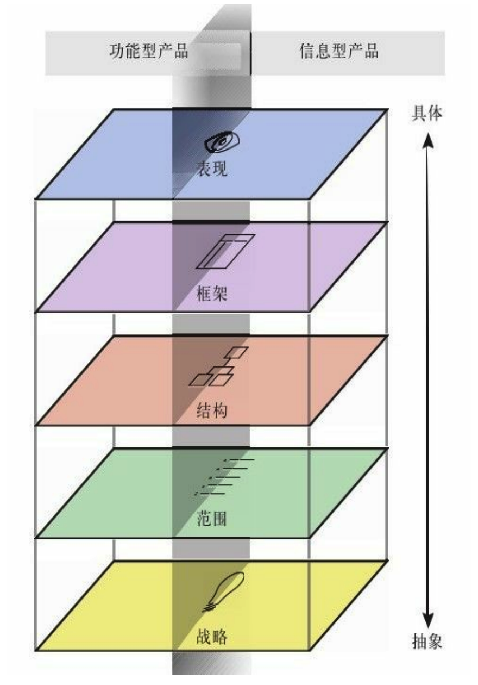

## 五个层面

大多数人都曾经通过网站购买过一个实物。这种经历几乎每一次是一样的——你到达网站，寻找你想买的东西（也许使用搜索引擎，也许使用分类目录），把你的信用卡号和邮寄地址告诉网站，然后网站则保证这个产品将递送到你的手中。

这个清晰、有条不紊的体验，事实上是由一系列完整的决策（大大小小的决策）组成的：网站看起来是什么样、它如何运转、它能让你做什么。这些决策彼此依赖，告知并影响用户体验的各个方面。如果我们去掉这些体验的外壳，就可以理解这些决策是如何做出来的了。

### 表现层

在表现层（surface），你看到的是一系列的网页，由图片和文字组成。一些图片是可以点击的，从而执行某种功能，例如把你带到购物车里去的购物车图标。一些图片就只是图片，比如一个促销产品的照片或网站自己的标志。

### 框架层

在表现层之下是网站的框架层（skeleton）：按钮、控件、照片和文本区域的位置。框架层用于优化设计布局，以达到这些元素的最大的效果和效率—使你在需要的时候，能记得标识并找到购物车的按钮。

### 结构层

与框架层相比更抽象的是结构层 （structure），框架是结构的具体表达方式。框 架层确定了在结账页面上交互元素的位置；而结构层则用来设计用户如何到达某个页面，并且在他们做完事情之后能去什么地方。框架层定义了导航条上各要素的排列方式，允许用户可以浏览不同的商品分类；结构层则确定哪些类别应该出现在那里。

### 范围层

结构层确定网站各种特性和功能最合适的组合方式，而这些特性和功能就构成了网站的范围层（scope）。比如，有些电子商务网站提供了一个功能，使用户可以保存之前的邮寄地址，这样他们可以再次使用它。这个功能（或任何一个功能）是否应该成为网站的功能之一，就属于范围层要解决的问题。

### 战略层

网站的范围基本上是由网站战略层 （strategy）所决定的。这些战略不仅仅包括了经营者想从网站得到什么，还包括了用户想从网站得到什么。就我们的网上商店的例子而言，一些战略目标是显而易见的：用户想要买到商品，我们想要卖出它们。另一些目标（如促销信息，或者用户填写的内容在商务模型中扮演的角色）可能并不是那么容易说清楚的。

## 自下而上地建设

这五个层面：**战略、范围、结构、框架和表现**，提供了一个基本架构，只有在这个基础架构上，我们才能讨论用户体验的问题，以及用什么工具来解决用户的体验。 在每一个层面中，我们要处理的那些问题有的抽象，而有的则更具体。在最底层，我们完全不用考虑网站、产品或服务最终的外观—我们只关心网站如何满足我们的战略（同时也满足用户的需求）。在最顶层，我们只关心产品所呈现的最具体的细节。随着层面的上升，我们要做的决策就一点一点地变得具体，并涉及越来越精细的细节。

每一个层面都是根据它下面的那个层面来决定的。所以，表现层由框架层来决定，框架层则建立在结构层的基础上，结构层的设计基于范围层，范围层是根据战略层来制定的。当我们做出的决定没有和上下层面保持一致的时候，项目常常会偏离正常轨道，完成日期延迟，而在开发团队试图把各个不匹配的要素勉强拼凑在一起的同时，费用也开始飞速上涨。更糟糕的是，这样的网站上线以后，用户也会痛恨它。这种依赖性意味着在战略层上的决定将具有某种自下而上 的“连锁效应”。反过来讲，也就意味着每个层面中我们可用的选择，都受到其下层面中所确定的议题的约束。

在每一个层面的决定都会影响到它之上层面的可用选项。

这种连锁效应意味着在“较高层面”中选择一个界限之外的选项将需要重新考虑“较低层面”中所做出的决策。 但是，这并不是说每一个“较低层面”上的决策都必须在设计“较高层面”之前做出。事物都有两个方面，在“较高层面”中的决定有时会促成对“较低层面”决策的一次重新评估（甚至是第一次评估）。在每一个层面，我们都根据竞争对手所做的事情、业界最佳的实践成果来做决定，这是最简单不过的老尝试。这些决策可能产生的连锁效应应该是双方向的。

要求每个层面的工作在下一个层面可以开始之前完成，会导致你和你的用户都不满意的结果.

一个更好的方法是让每一个层面的工作在下一个层面可以结束之前完成。

如果想在开始“较高层面”设计之前，要完全确定“较低层面”的话，几乎可以肯定的是，你已经把你的项目日程——也许是你最终产品的成功——扔进了一个危险的境地之中。 相反地，应该计划好你的项目，让任何一个层面中的工作都不能在其下层面的工作完成之前结束。这里最重要的一条是，在我们知道基本形状之前，不能为房屋加上屋顶。

## 基本的双重性

当然，用户体验的要素肯定不止这五个，与任何专业领域一样，这个行业也有它自己的专用术语。对于任何一个偶然进入这个领域的人来讲，用户体验可能显得非常复杂。所有看上去很相似的词汇有：交互设计、信息设计、信息架构。它们都是什么意思？做的是什么？

当网站刚刚兴起的时候，它完全是关于信息的。人们可以创建文档，然后把它们与其他文档链接起来。Web的发明者Tim Berners-Lee在最初创建Web时，是想把它当成高能物理研究人员相互沟通的一种方式。他把这项技术推向全世界，用于分享和参考彼此的发现。他知道Web的潜能 会比这个要大得多，但是很少有人能真正理解这些潜在能量会如此巨大。

人们最初把网页当成一种新的出版媒介，但随着先进技术和新特性不断被加入到网页浏览器和服务器之中，网页开始拥有更多的新能力。在网页开始变得流行，并成为一个更大的互联网社区之后，它发展了更复杂和强大的一些功能，这些功能使网站不仅仅能传达信息，还能收集和控制这些信息。有了这些功能，网站变得更加互动，响应用户输入的方式也更像传统的桌面应用程序。 随着商业行为在网站上的出现，这些功能找到了一个更大的应用范围，比如电子商务、交流论坛，其中还包括了网上银行。与此同时，网页作为一种出版媒介继续蓬勃发展，不计其数的报纸和杂志网站竞相发布只用于网站的“电子杂志”。在所有网站从静态地信息收集，逐渐过渡到动态的、以数据库驱动的网站（这种网站自身也一直在发展）的同时，技术也在不断地沿着这两个方向进化。 当网站的用户体验开始形成时，它的设计者采用的是两种不同的语言。一群人把每一个问题看成是“应用软件”的设计问题，然后从传统的桌面和客户端软件的角度来考虑解决方案（而这些方案的根基仍然是适应于制造各种产品的常规思路，不管是生产汽车还是跑鞋）。另一群人则从 信息的发布和检索的角度来看待网站，然后从传统出版、媒体和信息技术的角度来考虑问题的解决方案。 这就造成很大的沟通障碍。当大家不能在基本的专用名词上达成一致的时候，事情很少能顺利进展。当网站既不能干脆地分类到应用程序，也不能分类到信息资源（这是一个很大的概念，似乎是一种混合品，把各个领域中的特质都集为一身）的时候，这片水域就被进一步污染了。

为了解决网页这种基本的双重性质，让我们从中间把这五个层面分开。在左边，这些要素仅用于描述功能型的平台类产品。在右边，我们把这些要素用于描述信息型的媒介类产品。

在功能型产品这边，我们主要关注的是**任务**。所有的操作都被纳入一个过程，去思考人们如何完成这个过程。在这里，我们把网站看成用户用于完成一个或多个任务的一个或一组工具。 

在信息型产品这边，我们的关注点是**信息**。网站应该提供哪些信息，这些信息对用户的意义是什么。创建一个富信息（informationrich）的用户体验，就是提供给用户一个可以寻找、理解，且有意义的信息组合。

## 用户体验的要素 

现在，我们可以把所有混乱的词汇集放到这个模型里了。把每一个层面分成各个组成部分，通过这个方法，我们就可以仔细地看看所有这些片段是如何组合在一起，从而形成整个用户体验的。 

#### 战略层 

无论是在功能型产品还是信息型产品，战略层所关注的内容都是一样的。来自企业外部的用户需求（user need）是网站的目标——尤其是那些将要使用我们网站的用户。我们必须要了解这些观众想从我们这儿得到什么，还要知道他们想达到的这些目标将怎样满足他们所期待的其他目 标。 与用户需求相对应的，是我们自己对网站的期望目标。这些产品目标（product objective）可以是商业目的（通过网站达到今年100万美元的销售收入）或者是其他类型的目标（让选民了解下一届候选人的情况）。

#### 范围层 

从战略层进入范围层以后，在功能型产品一侧它就转变成创建功能规格（functional specification）：对产品的“功能组合”的详细描述。而在信息型产品一侧，范围则是以内容需求（content requirement）的形式出现：对各种内容元素的要求的详细描述。

#### 结构层 

在功能型产品一侧，结构层将从范围转变成交互设计（interaction design），在这里我们可以定义系统如何响应用户的请求。在信息型产品一侧，结构层则是信息架构（information architecture）：合理安排内容元素以促进人类理解信息。

#### 框架层 

框架层被分成了三个部分。不管是功能型产品还是信息型产品，我们必须要完成信息设计 （information design）：一种促进理解的信息表达方式。对于功能型产品，框架层还包括了界面设计（interface design），或者也可以说安排好能让用户与系统的功能产生互动的界面元素。对于信息型产品，这种界面就是导航设计（navigation design）：屏幕上的一些元素的组合，允许用户 在信息架构中穿行。

#### 表现层 

最后，我们还有表现层。不管是功能型产品还是信息型产品，在这里，我们的关注点都是一样的：为最终产品创建感知体验（sensory experience）。它做起来比说起来要棘手得多。

## 应用这些要素

这种把用户体验划分成各个方块和层面的模式，非常有利于我们去考虑用户在体验中有可能遇到的麻烦。但是在现实世界中，这些区域之间的界限并没有那么明确。最常见的情形是，你很难鉴定某个用户体验的问题是否可以通过重视这个要素或那个要素去解决。是在视觉上玩一些小把戏就可以呢，还是要改造最基本的导航设计？某些问题要求同时重视多个区域，而另一些甚至就横跨在这个模型中各个要素的边界上。 

很少有产品或服务只属于这两部分之一。在每一层中，这些要素必须相互作用才能完成该层的目标。在某个层面中，不考虑其他要素影响，单独评估你在某个要素上所做的改进产生的效果是很困难的。比如，信息设计、导航设计以及界面设计，它们共同定义了网站的框架层。所有处在同一个层面中的要素，即使它们是通过不同的方式，都会决定最终的用户体验。在这个例子里，就是“定义网站的框架”。

这样的组织方式使“设计用户体验”这件事更复杂了。在一些企业中，你会遇到一些被称为“信息架构师”或“界面设计师”的人。不要被这个现象搞糊涂了。这些人一般都具有很多种专业技能，这些技能包括大多数与用户体验要素有关的领域，而不仅仅是他们的职位名称所表明的那些内容。你的团队里，不一定非要一个了解各个领域的专家；你只需要保证至少有一个人花一部分时间来考虑每一个议题就行了。

还有两个额外的因素，它们将会对最终的用户体验产生影响，但是在这里无法详细描述。首先就是内容（content）。古语说（嗯，在web刚出现的时候）：在网页里“内容至上”。这绝对是个真理—大多数网站能提供给他们的用户的最重要的一件东西，就是这些用户认为有价值的容。

用户不会仅仅为了体验导航的乐趣而访问网站。你可以得到的内容（或你有资源去得到和管理的内容）将在你的网站中扮演一个非常重要的角色。在之前网上商城的例子中，也许我们决定让用户看到被出售的所有书籍的封面。如果能得到这些封面的话，我们有某种方法可以给它们分类吗？可以跟踪它们的变化，以及保持更新吗？如果某本书的封面我们根本就拿不到手，这种情况要怎么处理呢？这些内容问题，对用户在网站上的最终体验非常重要。

其次，技术（technology）也像内容一样，对于建立一个成功的用户体验很重要。在大多数案例中，你所能提供给用户的体验状态主要是由技术来决定的。在Web刚出现的时候，把网站和数据库连接起来的工具相当原始，而且非常有局限性。但不管怎样，随着技术的发展，数据库被更加广泛地用于网站的驱动和控制。这反过来又使得越来越精细的用户体验方法变得可能，例如动态的导航系统，就是一种根据用户在网站中的移动来改变导航的技术应用。技术总在变化，用户体验的领域必须要适应这些变化。虽然如此，用户体验的基本要素始终是不变的。

尽管用户体验要素的模型是我根据自身网站工作经历绘制的，但也有很多人将它应用到了更广泛范围的产品和服务之中。如果你是一个网站工作者，本书中所有的内容都很适合你；如果你是其他高科技产品的从业人员，你会对那些熟悉的思路产生强烈的似曾相识的感觉。即使你从事的产品或服务与技术无关，你仍然也能将这些概念映射到你自己的工作过程中。

接下来，我们将分层、来详细讨论这些要素。我们将仔细了解用于处理每一个要素的工具和技术。在这个过程中，我们将认识到这些要素是如何在一些非网站产品中发挥作用的。我们还 将知道每个层面中哪些要素是共同的，是什么让它们各不相同，以及它们是如何相互影响，然后创建出一个总体的用户体验的。