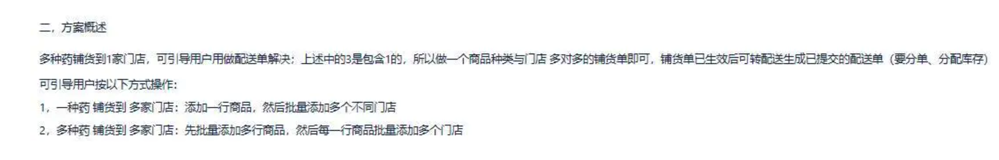
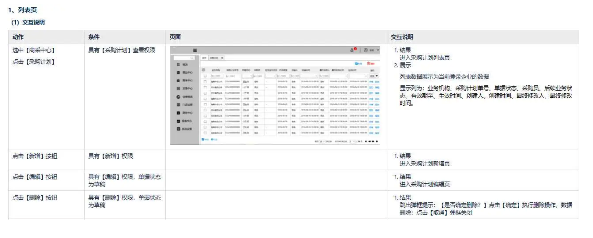
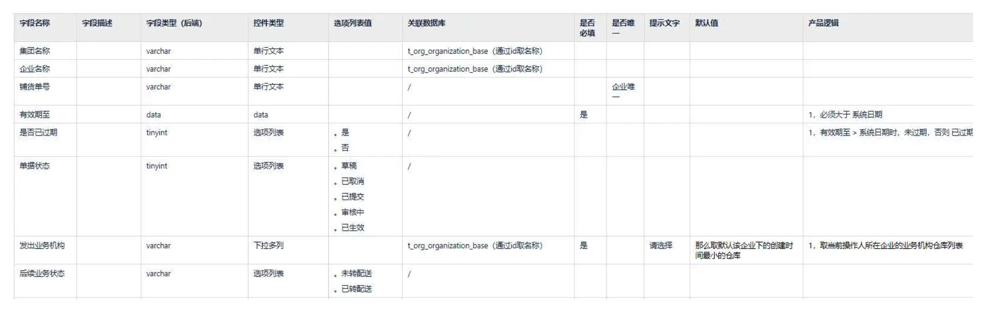
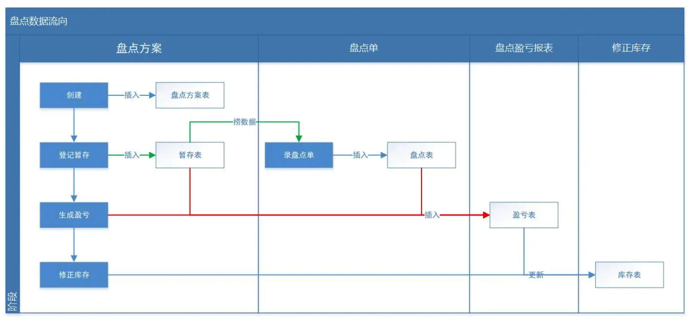

> 编辑导语：需求文档的撰写有助于产品经理更好地理清思路，协助后续项目业务的分析复盘，与此同时，也可以让团队人员更好地理解业务需求，推动项目进行。那么，B端产品经理如何撰写出让开发测试都能理解且认可的需求文档？本文作者做了总结，一起来看一下。

## 一、客观场景

据调研，开发测试非常反感以下类型的B端产品经理：

- 业务流程都整不明白，还是开发帮其捋出来的；
- 讲完一个需求，让开发花几天或几周时间梳理其不明确的逻辑点；
- 已经到了敲代码阶段了，还在多次改需求；
- 写的需求来自拍脑袋而不是客观业务背景；
- 需求文档让测试根本不知道怎样写测试用例。

这些问题的解决办法除了用人情交际手段、扯皮解决，还可以从严于律己的角度出发，踏踏实实写好PRD文档，写出能征服开发、测试的PRD文档，然后宣讲需求的时候按照文档写的顺序宣讲就行。

“怎么写PRD文档”这常常是培训机构做的事情，主要给那些将要做产品经理的新人同学看，我讲的是“怎样写出征服开发测试的B端PRD文档”，主要写给已经做B端产品经理2年以上的同学看，目的是让B端产品经理能通过PRD文档表达实力、提升能力、征服开发，从而提高产研协作效率和竖立产品经理威严。

## 二、开发测试的诉求

那么到底怎样才能写出征服开发测试的B端PRD文档 ？

首先就得分析开发测试通过PRD文档到底想知道什么、也就是其需求是什么，然后有效地满足他们的需求，最后在宣讲需求的时候用通俗易懂的话讲清楚、让听众听明白。那么开发测试到底通过PRD文档主要想知道什么呢？

### 1. 前端开发

- 哪些增删改查页面要做；
- 每一个界面交互逻辑；
- 哪些节点要请求后端哪些接口；
- 为何要做这个需求。

### 2. 后端开发

- 核心和具体功能的业务流程是什么；
- 前端的哪些交互需要调用我的什么接口；
- 涉及到哪些表，表之间的数据流向是什么、表结构怎样设计；
- 需要其它后端开发配合我联调什么接口；
- 为何要做这个需求。

### 3. 测试

- 要写哪些明确的用例。

## 三、八招征服

那么到底怎样写PRD文档，才能满足开发测试上面的这些需求呢？

经过6年的ERP、供应链相关产品设计实战，我总结出了“八招”，读者在使用这八招时需要实事求是一切从实际出发，毕竟难度很大。为了让读者理解起来不那么枯燥，我把这8招分开阐述，且配了相关案例。

### 1. 更新标记

无论是创建一个全新的大需求，还是在已有需求中增删改需求都要有标记，这样就可追溯需求。如果不这样做，有时产品经理自己就会发现之前的逻辑是什么不知道，特别是前任产品离职后如果不交接清楚，你接收后会一脸懵。

我说的标记是只在文档内容中要有标记，这样开发测试只需搜索这个标记就知道了“这个需求”涉及哪些，而不是要全文阅读。就好像你在监控下面干了什么，都被拍下来了一样，下面我列举了2个简单案例。

**1）修改字段名称**

**2）修改一段逻辑**

### 2. 业务场景

要写清楚业务上遇到什么了问题，然后你的产品方案是要解决这个问题的，不然开发测试不知道你为何要做这个需求。还要写清楚这个问题是怎样来的，是来自实际业务、还是谁拍脑袋的，这样开发测试就知道了需求的真实性。

如果你还有空的话，可以写下分析这个问题的过程、以及解决这个问题的多种方案，这样开发测试就能身临其境地知道了这个需求的来龙去脉。

### 3. 方案概述

写完业务场景就要写方案概述，主要就是用产品语言概述上面的问题是怎样解决的，这个需求涉及到哪些业务模块、涉及到哪些核心逻辑。

这样宣讲需求时开发凭此就可判断是否与自己有关系了，就不会出现“某开发参加需求评审个把小时却发现自己不需要做啥，然后耽误了敲代码的时间搞的晚上又要加班”。而且开发主管也可以根据这个方案概述就能判断出来需要给什么样的开发资源、开发周期。

### 4. 业务流程

写完方案概述开发测试只知道要干什么，但是具体怎样做是不知道的，这时就要开始写业务流程，最好用泳道图写清楚各种判断逻辑、涉及的用户角色、业务模块等。后端开发看这个的时候，脑子里就会想数据流向、需要哪些接口、用哪张表。

业务流程就好像是开车时使用的地图导航、就好像是打仗时制定的路线图，对于B端产品经理来说“无论多么复杂的业务都可以用流程图表达出来”是基本的能力，这里我就不放按案例图片了。对于开发来说非常反感的一种B端产品经理就是“一个需求竟然画不清楚、说不清楚流程”。

### 5. 前端交互

只有业务流程来表达一件事情的解决过程还是有些抽象，所以此时要用原型页面来形象表达，这块UI和前端会重点看需要做哪些增删改查页面、哪些交互，后端也会思考需要封装哪些接口给前端调用。

注意这里不是简单用原型工具画几个页面把链接抛给开发就行，而是要按一定的格式（条件、动作、页面、结果）写出每一个交互、每一个字段，具体可看下面案例。

有一种产品经理是非常让开发测试反感的，就是“需求的输出方式就是一个原型文件，点开后发现就基本的列表页、新增编辑页、详情页，其它逻辑靠猜”。

以我这样的方式写前端交互有个弊端就是比较花时间，最大的优势就是可以不漏掉每一个交互逻辑、每一个字段，下面我只是举了2个非常简单的例子。

**1）列表页中的每一个字段名称、排序要写出来，以免遗漏**

**2）新增、编辑页中的每一个交互，用“条件、动作、页面、结果”这一格式表达**

### 6. 表结构

这块目前市面上90%以上的B端产品经理都不会写，因为笼统地觉得这是开发的事情。如果产品经理能把这个需求需要设计哪些表、需要哪些字段、以及每个字段的相关信息都写出来，那么开发设计表结构的时候就可以借鉴、确认，这样开发真的会非常佩服你。

这块的基础就是产品经理要懂sql的基本查询语句，如果懂了真的是如虎添翼，写需求的时候能更加从开发的角度考虑问题了。以下案例中的每一列名称的使用，需要有一定数据库功底的产品经理才能掌握。

### 7. 数据流向

从哪个表取数据插入或更新到哪个表，用什么样的入参去请求哪个接口返回出什么样的值，这个开发是非常关心的。

开发敲的代码操纵的就是表，也就是说在开发眼中功能的本质就是数据的流向，而数据流向的载体是表和接口，数据流向是业务流程的技术理解。这块需要有一定数据库和接口功底的B端产品经理才写得出来。

### 8. 评审问题

在产品宣讲或开发过程中，开发提的一些重要问题的答案这里要记录下来，这样就方便其它开发看，也更能明确需求。特别是产品文档中没写的逻辑，在评审时开发发现了然后经过讨论后定下来了，就更加要写到这上面来了。

这块其实是对需求文档的一个查漏补缺，如果不记录那么也许过一段时间又会忘记这些重要逻辑，记录采取这样的格式就行“提出人、提出时间、问题、答案”。

## 四、总结

到了这里就写完了，这八招是对B端产品经理的高严格、高标准，所以在实际应用过程中需要一切从实际出发，毕竟通过口述需求、原型文件、一个PPT、简单写一段文字、甚至画个草图给开发，开发也是能把需求实现的。

产品经理写的文档就相当于是自己的艺术作品，如果你对自己的艺术作品是高标准的，那么我相信假以时日你在开发测试眼中将是一块金字招牌，都乐于和你合作。

我不会写一篇虚的文章，每篇文章都是来自多年ERP、供应链相关产品经理工作的总结。我不需要任何一个读者给我鼓掌或者觉得我讲的有道理，我需要的是阅读此文后你能在工作中用得上，这样就能帮助你更优秀。

转载来源：[产品老兵_征服开发测试的B端PRD文档是怎样写成的](https://www.woshipm.com/pmd/3142586.html)
