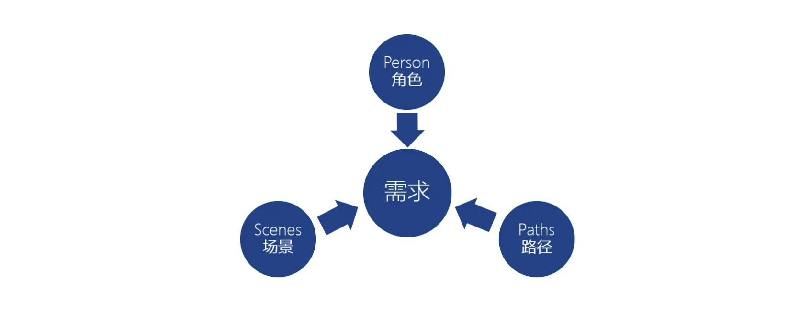
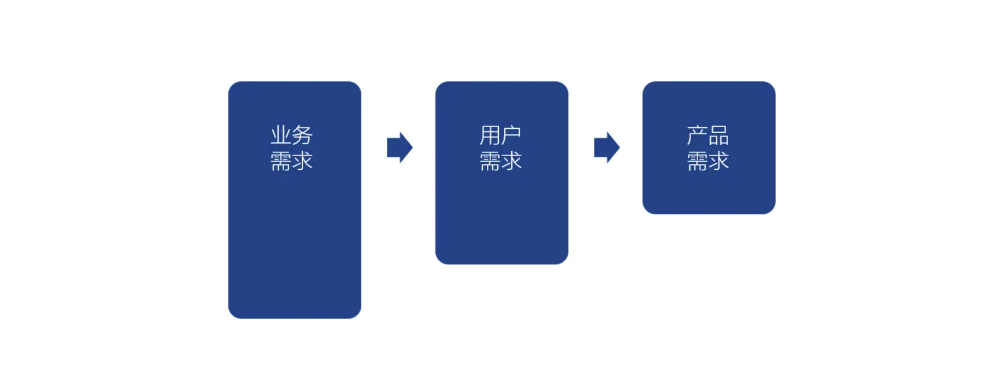
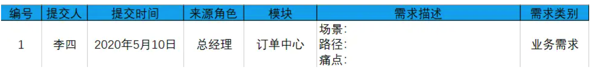
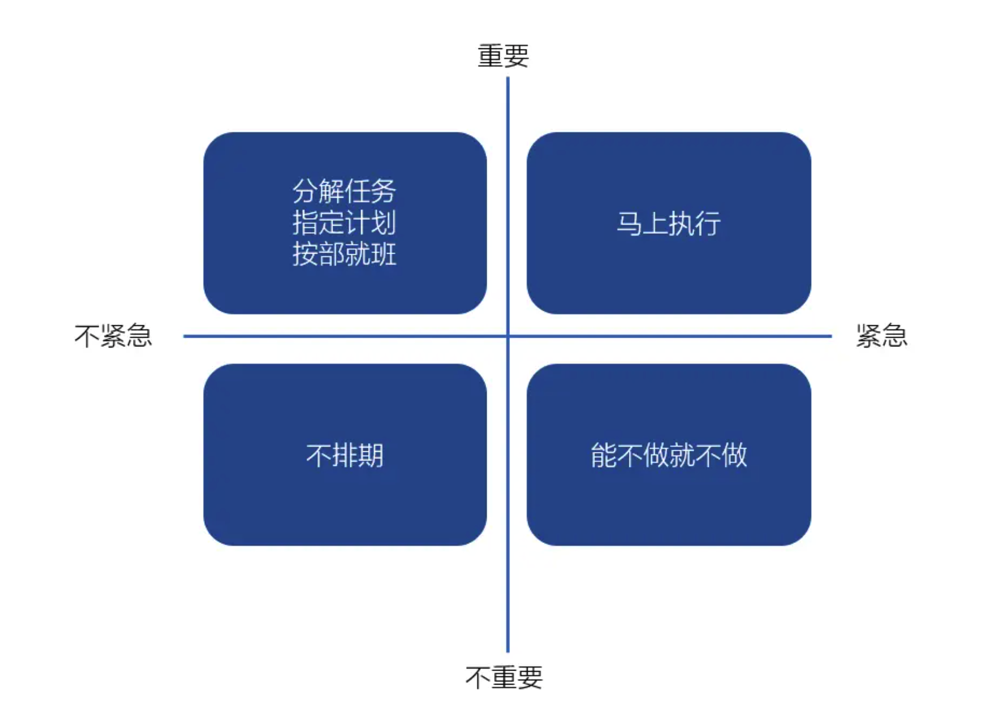
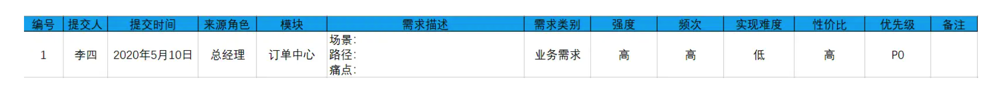

> 本文作者从自身工作经验出发，结合相关案例，分享了关于B端产品分析需求流程的相关经验，供大家一同参考和学习。

## 问题

如果没做过、或者接触后台产品较少的产品同仁，拿到后台产品，会发现在整理需求时会出现以下几个问题：

1. 你会发现需求都非常明确，但又过于显性，很难抽象，无法构成完整的逻辑链条；
2. 需求很难判断优先级，你也无法用数据证明，最后导致很多时候判断优先级的标准就成了“人制”，KP提的就是高优先级，其他人提的就是低优先级，这样的“人肉”决定，必然会导致产品判断在一些方面的失准。

## B端产品分析全流程

### 1. 项目背景：解决什么问题

项目背景非常重要，特别是对于B端产品，产品目的性极强，我们就是要通过产品来解决用户的问题，所以搞清楚用户到底想要解决什么问题至关重要，无论做任何产品，弄清楚为什么，也就是产品目的对于产品经理来说都至关重要，在这里推荐“**第一性思维**”，这本是物理学的研究方法，剥开事物表层的一层层面纱，看到里面最核心的本质，然后再从本质一层层往上倒推。有一个简单的办法就是**连环追问法**。其中在B端产品经理思考时，除了反复的逻辑推导，我想强调的是一定要能摒除权威干扰，很多B端产品经理，在调研需求时面对的很多都是在行业内呼风唤雨的人物，这个时候很容易陷入盲从，导致需求分析的干扰巨大，很难创新性地更高效率地解决问题。

作为科技大佬“钢铁侠”的埃隆马斯克，是这样描述第一性原理的，“我相信有一种很好的思考架构，就是第一性原理，我们能够真正地去思考一些基础的真理，并且从中去论证，而不是类推。我们绝大多数时候都是类推地思考问题，也就是模仿别人做的事情并加以微幅更改。但当你想要做一些新的东西时，必须要运用第一性原理来思考。”

毕竟客户是需要专业的人来解决问题不是找一个转换器和传声筒。

其次，就是要初步了解要解决谁的问题，这个里面要调研清楚，谁是这项目的KP，谁是核心的干系部门和干系人等，虽然我们不盲从权威，但干系人对项目的影响也不可忽略，B端的项目大部分KP具有决定性的作用，所以除了从他们这获取信息，和他们无碍的沟通也十分重要。

### 2. 弄懂商业模式

弄清楚项目背景后，就需要进一步对整个公司的商业模式做一个系统了解，这也正式进入了可以直接指导产品分析和设计的部分。

在分析商业模式时，很多产品经理都会被很多公司复杂的业务流程绕晕，特别是ERP等复杂系统，这里就要求我们具备强大的业务虚拟化的能力，这里推荐大家整理项目的主干流程，这个其实不是很难，我们集中于以下几个问题：

- 公司主要经营什么产品，产品来源于哪，也就是靠什么获利，是实际产品，还是服务还是什么？
- 通过什么方式进行售卖，线上渠道还是线下方式，怎么对这些渠道进行管理的？
- 通过什么方式获利的，是靠直接卖产品或服务，还是赚差价，还是羊毛出在猪身上？

弄清楚这样几个问题，这个主线就清楚了，弄清楚背景和商业模式后就可以进入需求收集和整理阶段。

### 3. 需求收集——“PSP”方法

进入需求收集阶段，我们主要使用“PSP”方法，P：即Person，角色；S：即Scenes，场景；P：即Paths，路径。

Person：首先需要产品经理析出流程中的角色，不同于C端用户画像的纷杂，B端的用户往往很清楚，同种类的用户集合即为用户角色，产品需求即是全部用户角色所提的需求，所以这个时候我们在标注提出人时就不能仅仅标注某人，并且一定要标注出**我们经过总结后的角色**，这一点十分重要，**决定这个需求后期的归属和优先级的判断**。

Scenes：场景，场景是产品经理耳熟能详的概念，但在B端产品，角色提出的需求我们需要在详尽的场景中去进行推导，一方面更好的理解需求，另一方面也可以通过此更好地判断需求。在场景的位置要特别关注原有的工作的痛点，很多新手在记录需求时仅仅记录了一个场景，但并没有**提取出痛点**，这个时候是不全面的。

Paths：路径，角色在场景中想要达到相应的目标，需要一条路径，对于B端产品很多就是将这些原有的路径通过信息化的方式提高效率，所以对于路径的记录十分重要，另一方面，在交互中，路径是重要的指导信息。

### 4. 需求整理“三分法”

“三分法”是重要的B端需求整理的维度。

业务需求：业务需求是B端产品最重要部分，B端产品往往有着明确的指向目的，是为了完成经济体的目的的产物，所以要将直接对产生商业价值的需求提出来，作为重点关注需求。

用户需求：关于这个位置的用户包括两类重要的用户。第一类就是作为客户方整个项目的决策者和管理层，从这类用户我们可以从更高的战略角度来理解产品的宏观需求，第二类是实际使用的客户，我们可以从这类用户获得关于产品细节设计的相关信息。

作为实际使用产品的使用者，会对产品的形态和体验有自己的要求，

产品需求：这一点是从整个公司的产品与产品之间来考虑的，B端产品不同于C端，单个独立，B端产品需要和很多系统进行深度交互，所以提前进行产品规划，预留好接口是非常有必要的。

按照上面的步骤我们可以将需求表格制作如下：

### 5. 确定需求优先级

在这里通过以上准备的信息，共归纳为两个维度来对需求的优先级进行排序：
1. 由来源角色、需求类别、需求强度决定的需求的重要程度；
2. 由痛点描述和需求频次决定的需求紧急程度。

四象限这个大家都比较清楚，这里就不赘述了，这里可以给大家提一个思路，矩阵思维非常有助于需求判断，矩阵最重要的就是对目标对象的关联因子，逻辑分析和规整，抽取形成几个维度，通过这几个维度构建结构化矩阵辅助我们进行思考，这里给大家看的是常规的“四象限”矩阵，大家也可以根据实际情况运用矩阵思维进行延展。

最后加入一项重要的需求判断因素-实现难度。“PSP”共同决定的需求的实现难度，根据重要程度和实现难度的比值可以对具体需求进行开发项目排期。

最终需求分析表格如下：

这里特别强调一下，在实际工作中，特别是B端的很多时候，KP提出的点，我们也许优先级不高，但如果被之反复强调，也别硬顶，千万别觉得自己是最有智慧的，反复验证，如果确认是优先级很低的，我们还是要开发，我们可以通过最简单的流程实现，尽量减少投入，做出平衡。

转载来源：[B端产品分析全流程：从项目背景到需求优先级](https://www.woshipm.com/pmd/3867086.html)
