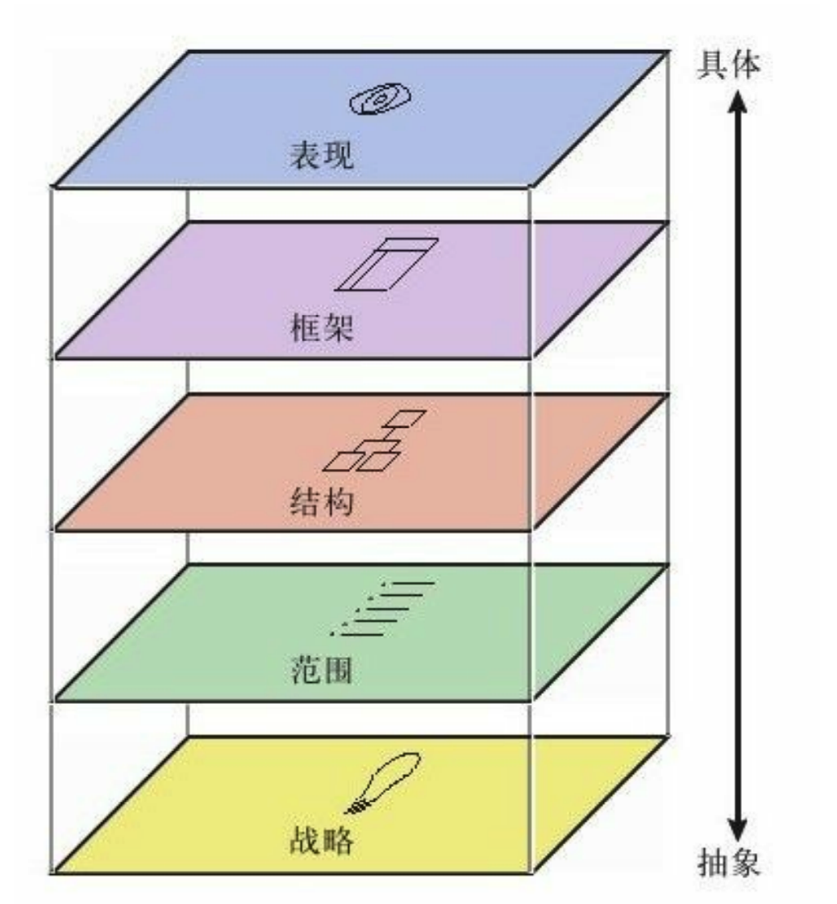
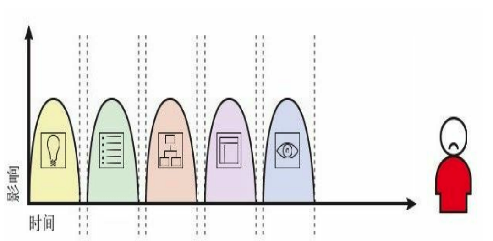
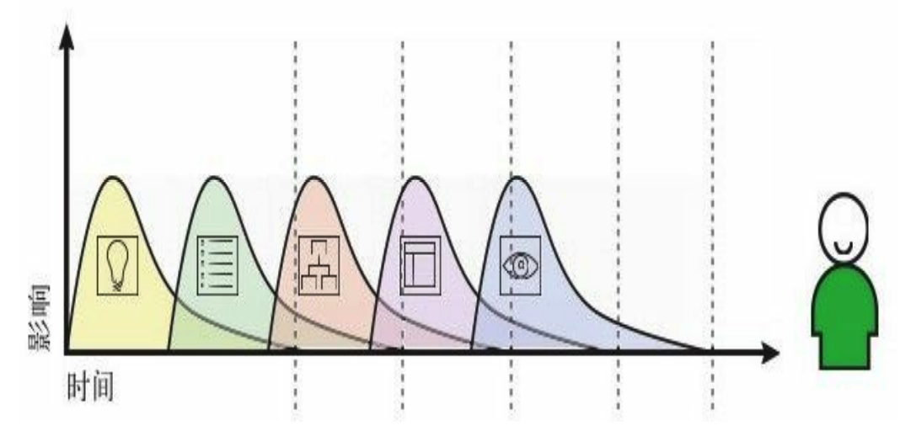

## 五个层面

大多数人都曾经通过网站购买过一个实物。这种经历几乎每一次是一样的——你到达网站，寻找你想买的东西（也许使用搜索引擎，也许使用分类目录），把你的信用卡号和邮寄地址告诉网站，然后网站则保证这个产品将递送到你的手中。

这个清晰、有条不紊的体验，事实上是由一系列完整的决策（大大小小的决策）组成的：网站看起来是什么样、它如何运转、它能让你做什么。这些决策彼此依赖，告知并影响用户体验的各个方面。如果我们去掉这些体验的外壳，就可以理解这些决策是如何做出来的了。

### 表现层

在表现层（surface），你看到的是一系列的网页，由图片和文字组成。一些图片是可以点击的，从而执行某种功能，例如把你带到购物车里去的购物车图标。一些图片就只是图片，比如一个促销产品的照片或网站自己的标志。

### 框架层

在表现层之下是网站的框架层（skeleton）：按钮、控件、照片和文本区域的位置。框架层用于优化设计布局，以达到这些元素的最大的效果和效率—使你在需要的时候，能记得标识并找到购物车的按钮。

### 结构层

与框架层相比更抽象的是结构层 （structure），框架是结构的具体表达方式。框 架层确定了在结账页面上交互元素的位置；而结构层则用来设计用户如何到达某个页面，并且在他们做完事情之后能去什么地方。框架层定义了导航条上各要素的排列方式，允许用户可以浏览不同的商品分类；结构层则确定哪些类别应该出现在那里。

### 范围层

结构层确定网站各种特性和功能最合适的组合方式，而这些特性和功能就构成了网站的范围层（scope）。比如，有些电子商务网站提供了一个功能，使用户可以保存之前的邮寄地址，这样他们可以再次使用它。这个功能（或任何一个功能）是否应该成为网站的功能之一，就属于范围层要解决的问题。

### 战略层

网站的范围基本上是由网站战略层 （strategy）所决定的。这些战略不仅仅包括了经营者想从网站得到什么，还包括了用户想从网站得到什么。就我们的网上商店的例子而言，一些战略目标是显而易见的：用户想要买到商品，我们想要卖出它们。另一些目标（如促销信息，或者用户填写的内容在商务模型中扮演的角色）可能并不是那么容易说清楚的。

## 自下而上地建设

这五个层面——战略、范围、结构、框架和表现——提供了一个基本架构，只有在这个基础架构上，我们才能讨论用户体验的问题，以及用什么工具来解决用户的体验。 在每一个层面中，我们要处理的那些问题有的抽象，而有的则更具体。在最底层，我们完全不用考虑网站、产品或服务最终的外观—我们只关心网站如何满足我们的战略（同时也满足用户的需求）。在最顶层，我们只关心产品所呈现的最具体的细节。随着层面的上升，我们要做的决策就一点一点地变得具体，并涉及越来越精细的细节。

每一个层面都是根据它下面的那个层面来决定的。所以，表现层由框架层来决定，框架层则建立在结构层的基础上，结构层的设计基于范围层，范围层是根据战略层来制定的。当我们做出的决定没有和上下层面保持一致的时候，项目常常会偏离正常轨道，完成日期延迟，而在开发团队试图把各个不匹配的要素勉强拼凑在一起的同时，费用也开始飞速上涨。更糟糕的是，这样的网站上线以后，用户也会痛恨它。这种依赖性意味着在战略层上的决定将具有某种自下而上 的“连锁效应”。反过来讲，也就意味着每个层面中我们可用的选择，都受到其下层面中所确定的议题的约束。

在每一个层面的决定都会影响到它之上层面的可用选项。

这种连锁效应意味着在“较高层面”中选择一个界限之外的选项将需要重新考虑“较低层面”中所做出的决策。 但是，这并不是说每一个“较低层面”上的决策都必须在设计“较高层面”之前做出。事物都有 两个方面，在“较高层面”中的决定有时会促成 对“较低层面”决策的一次重新评估（甚至是第一次评估）。在每一个层面，我们都根据竞争对手所做的事情、业界最佳的实践成果来做决定，这是最简单不过的老尝试。这些决策可能产生的连锁效应应该是双方向的。

要求每个层面的工作在下一个层面可以开始之前完成，会导致你和你的用户都不满意的结果.

一个更好的方法是让每一个层面的工作在下一个层面可以结束之前完成 

如果想在开始“较高层面”设计之前，要完全确定“较低层面”的话，几乎可以肯定的是，你已经把你的项目日程——也许是你最终产品的成功——扔进了一个危险的境地之中。 相反地，应该计划好你的项目，让任何一个层面中的工作都不能在其下层面的工作完成之前结束。这里最重要的一条是，在我们知道基本形状之前，不能为房屋加上屋顶。

